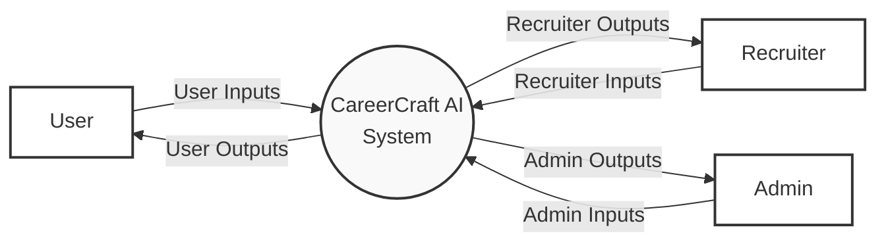
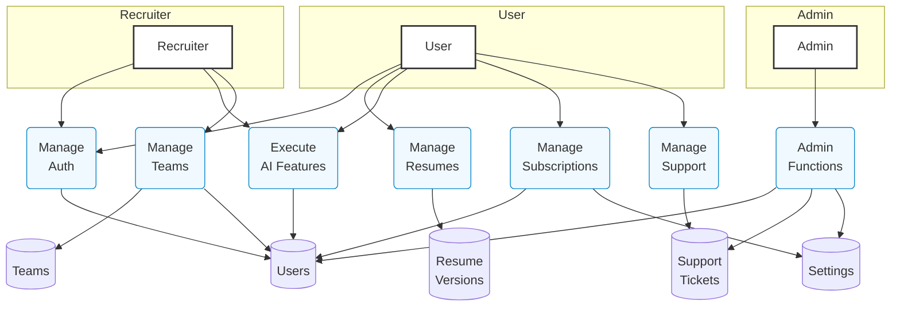
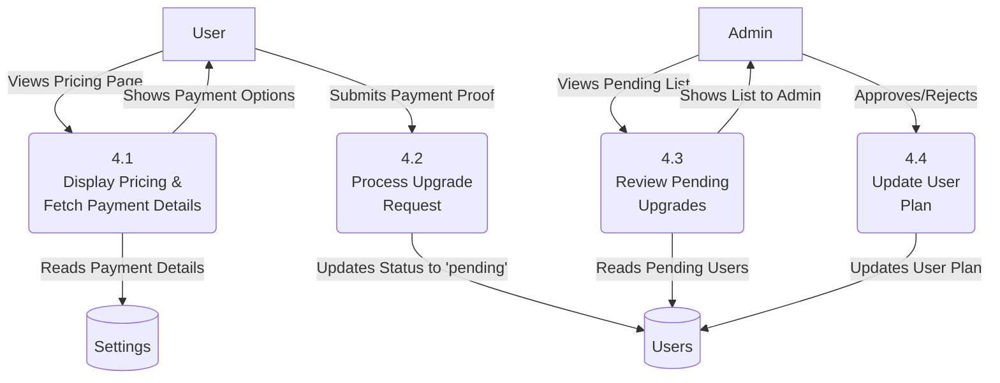
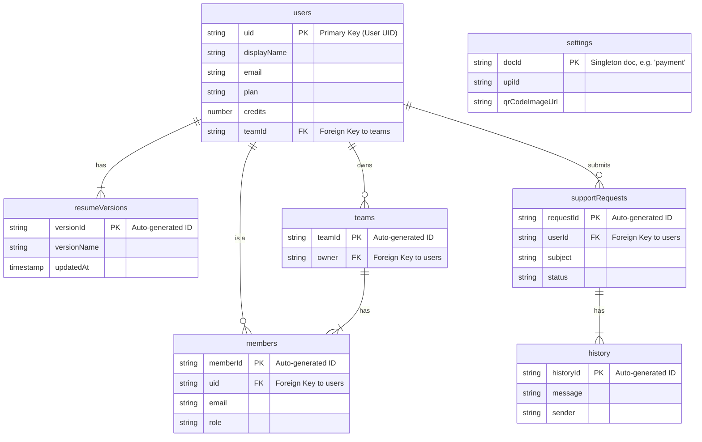
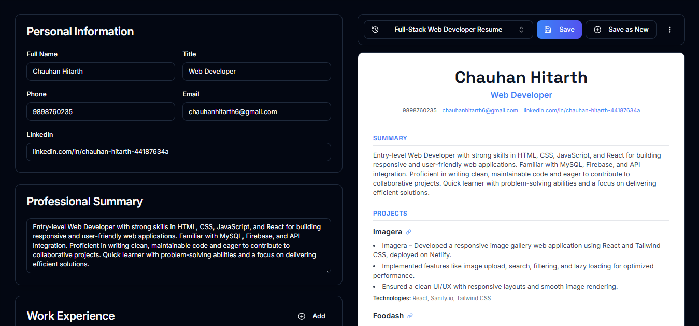
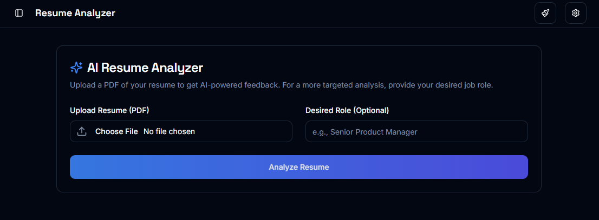
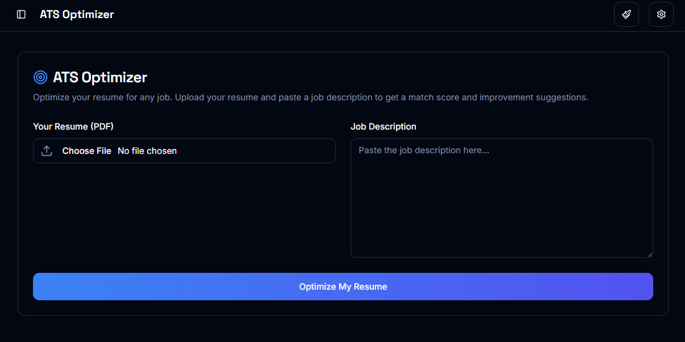
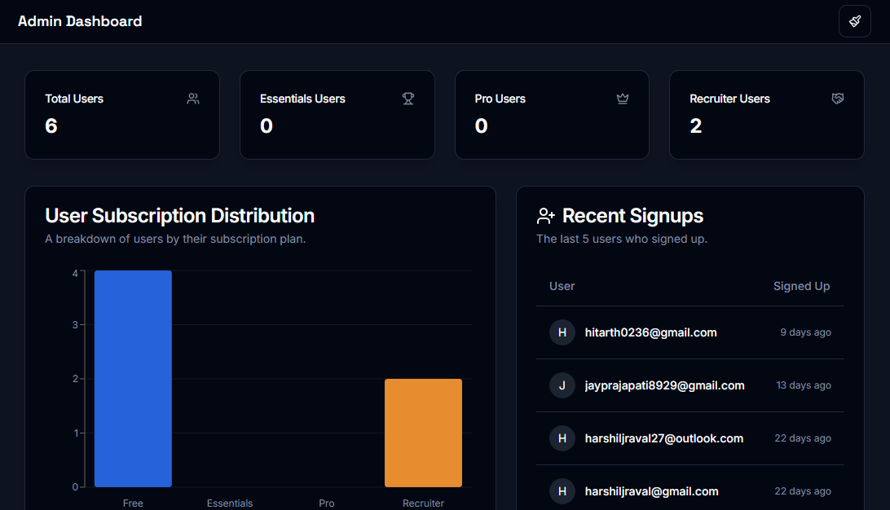
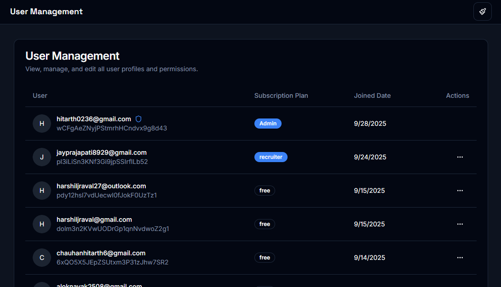

# CareerCraft AI - Project Report

**Author:** CHAUHAN HITARTH  
**Date:** October 26, 2023

---

## Index

| Sr No. | Index                                     |
|--------|-------------------------------------------|
| 1.     | **Introductions**                         |
|        | 1.1 Acknowledgement                       |
|        | 1.2 About College                         |
|        | 1.3 About Organization                    |
|        | 1.4 Project Profile                       |
| 2.     | **Literature Survey**                     |
|        | 2.1 Overview of Project                   |
|        | 2.2 Existing System                       |
|        | 2.3 Need for New System                   |
| 3.     | **Analysis**                              |
|        | 3.1 Software & Hardware Requirement       |
|        | 3.2 Objective                             |
|        | 3.3 Feasibility Study                     |
| 4.     | **Experimental or Material Method**       |
|        | 4.1 Design Methodology                    |
|        | 4.2 DFD (Data Flow Diagram)               |
|        | 4.3 ER (Entity Relationship Diagram)      |
|        | 4.4 Data Dictionary (Database Schema)     |
| 5.     | **Result & Performance Analysis**         |
|        | 5.1 Process Description (Implementation)  |
|        | 5.2 Input Design (UI/UX)                  |
| 6.     | **Conclusion & Future Enhancement**       |
|        | 6.1 Conclusion                            |
|        | 6.2 Future Enhancement                    |
| 7.     | **Testing & Bibliography**                |
|        | 7.1 Testing                               |
|        | 7.2 Bibliography                          |

---
# Chapter 1: Introduction

## 1.1 Acknowledgement

We would like to express our heartfelt gratitude to **INSB INST OF INFO TECH & MGT STD, BCA COLLEGE & ACCHE PGDCA COLLEGE** for their unwavering support and encouragement throughout the development of this *CareerCraft AI System*. Their expertise and guidance have been pivotal in shaping the project’s direction and ensuring its successful completion.

We extend our sincere thanks to **Project Guide** for their invaluable mentorship. Their insightful feedback and constructive critiques have been instrumental in refining the project and enhancing its overall quality. We thank all of the staff members of our college who helped us directly or indirectly during our project period.

This project would not have been possible without the collective contributions of these individuals and organizations. Their support has left an indelible mark on the success of this *CareerCraft AI System*, and for that, we are truly grateful.

**With Regards,**
**Hitarth Chauhan**

---

## 1.2 About College

BCA/PGDCA College, Idar was established by **Uttar Sabarkantha Uchha Kelavani Mandal Idar** in the year 2000 with the aim to serve the educational needs of the rural and developing area of north Sabarkantha.
Our main objective is to provide society with competent men and women who have attributes of functional and social relevance, mental ability and physical dexterity, effectiveness and reliability and above all, the confidence and capability to communicate effectively and exercise initiative, innovation and experiments with new situations.

The management of our college has a definite vision of achieving excellence in being an ideal educational institution, which is being materialized by the sincere efforts of all concerned stakeholders. Our college is engaged in the pious work of modeling the young people who are the builders of the nation.

---

## 1.3 About Organization

### 🧭 Who We Are

**CareerCraft AI** is a dynamic team of developers, designers, and innovators dedicated to transforming the way students, job seekers, and recruiters connect through intelligent career management solutions.
Our mission is to create a unified digital platform that empowers users to craft professional resumes, analyze job-fit, and collaborate with recruiters — all powered by artificial intelligence.

### ⚙️ What We Do

CareerCraft AI integrates modern web technologies and AI-driven analytics to provide personalized career insights, resume optimization, and efficient candidate–recruiter matching.
We focus on building scalable, responsive, and user-friendly systems that combine data intelligence with simplicity and design excellence.

Our areas of expertise include:

* Front-end development using **Next.js** and **Tailwind CSS**
* Backend integration with **Firebase Authentication** and **Cloud Firestore**
* Real-time **AI resume analysis** and **candidate matcher** tools
* Dashboard analytics for **students, professionals, and recruiters**
* Secure payment and subscription management for premium features

### 💡 Why Choose CareerCraft AI

* AI-powered Resume & Job Matching System
* Clean, Modern, and Responsive UI
* Scalable Firebase-based Architecture
* Real-time Data Synchronization & Analytics
* Easy Collaboration for Recruiters and Teams

### 📞 Contact Us

**CareerCraft AI Development Team**
Department of Computer Science
INSB Institute of BCA & PGDCA, Near Bus Stand
Idar – 383430, Gujarat, India
📧 [hitarth0236@gmail.com](mailto:hitarth0236@gmail.com)
📱 +91-98987 60325

### 1.4 Project Profile

*   **1. Project Title**
    *   CareerCraft AI – An AI-Powered Career Platform

*   **2. Objective**
    *   The objective of CareerCraft AI is to deliver a modern, intelligent platform that empowers job seekers with AI-driven tools for resume building and career planning, while also streamlining the recruitment process for hiring managers.
    *   Key goals include:
        *   Providing a seamless resume building and management experience.
        *   Offering AI-powered analysis and optimization for resumes and cover letters.
        *   Supporting secure user authentication and tiered subscription plans.
        *   Delivering an intuitive and responsive user interface for both job seekers and recruiters.
        *   Leveraging Firebase and Genkit for a scalable, serverless backend and AI integration.
        *   Equipping recruiters with advanced tools like AI Candidate Matcher and team management.
        *   Providing a comprehensive admin panel for user management and subscription approval.

*   **3. Developed By**
    *   CHAUHAN HITARTH

*   **4. Project Guide**
    *   (Placeholder for Project Guide Name)

*   **5. Frontend Technologies**
    *   **Next.js (React):** A modern framework for building performant, server-rendered web applications.
    *   **TypeScript:** For strong typing and improved code quality.
    *   **Tailwind CSS:** A utility-first CSS framework for rapid UI development.
    *   **shadcn/ui:** A collection of beautifully designed, accessible UI components.

*   **6. Backend Technologies**
    *   **Firebase:** Provides authentication, a NoSQL Firestore database for data storage, and file storage.
    *   **Genkit (Google AI):** Used for integrating powerful generative AI models (like Gemini) for all intelligent features.

---

## 2. Literature Survey

### 2.1 Overview of Project

CareerCraft AI is an innovative, AI-powered platform designed to revolutionize the job application and recruitment process. For job seekers, it offers a suite of intelligent tools to help them craft compelling applications and stand out in a competitive market. For recruiters, the platform provides an AI Candidate Matcher to streamline the screening process, saving time and improving the quality of hires.

Built with a full-stack approach, the application uses:
*   **Next.js (React):** For a component-based, responsive frontend.
*   **Tailwind CSS & shadcn/ui:** For clean, utility-first styling and a modern UI.
*   **Firebase:** As a serverless backend for authentication, database (Firestore), and storage.
*   **Genkit (Google AI):** For all AI-driven features, including resume analysis and candidate matching.

Key Features Include:
*   **Intuitive Resume Builder:** Create and manage multiple resume versions with a live preview.
*   **AI Resume Analyzer:** Get instant feedback on strengths, weaknesses, and keyword optimization.
*   **AI Candidate Matcher:** For recruiters to score and rank resumes against a job description.
*   **Tiered Subscription Model:** Offering 'Free', 'Pro', and 'Recruiter' plans with varying levels of access.
*   **Admin & User Dashboards:** Separate interfaces for user management and application functionality.

The main goal of CareerCraft AI is to combine a user-friendly design with powerful AI functionality—creating a seamless, responsive experience for both job seekers and hiring managers. It serves as a practical demonstration of:
*   Real-time, serverless backend integration.
*   Scalable architecture using modern cloud services.
*   The application of generative AI in a real-world use case.

### 2.2 Existing System

Popular platforms like LinkedIn, Indeed, and traditional resume builders dominate the job market but are often generic, ad-driven, and fail to provide deep, personalized guidance for job seekers.

**Limitations of Current Platforms:**
*   **Generic Templates and Feedback:** Offer basic templates and superficial advice, lacking personalized, AI-driven analysis.
*   **Fragmented User Experience:** Job seekers must use separate tools for resume building, job searching, and application tracking.
*   **Inefficient for Recruiters:** Manual screening of hundreds of resumes is time-consuming and prone to bias.
*   **Lack of Actionable Insights:** Fail to provide users with clear, data-driven steps to improve their resume's effectiveness.

**Need for a Better Alternative:**
An intelligent, all-in-one platform that empowers both job seekers and recruiters with:
*   An integrated resume builder with version control.
*   AI-powered analysis for resumes, cover letters, and job matching.
*   A streamlined, serverless architecture for a fast and reliable experience.
*   Dedicated tools for recruiters to automate and enhance candidate screening.

### 2.3 Need for New System

While platforms like LinkedIn and Indeed offer a wide reach, they lack the focused, intelligent tools needed for effective career development and modern recruitment.

**Key Limitations of Existing Platforms:**
1.  **Generic Guidance** - Offer one-size-fits-all advice, not personalized AI analysis.
2.  **Inefficient for Recruiters** - Manual screening is slow, biased, and resource-intensive.
3.  **Fragmented Experience** - Users need separate tools for building, analyzing, and matching.
4.  **Cluttered and Distracting** - Often filled with ads and irrelevant social features.
5.  **Lack of Deep Insights** - Fail to provide actionable steps for resume improvement.
6.  **Poor Skill-Job Alignment** - Basic keyword matching often misses true candidate potential.

**Why CareerCraft AI?**
CareerCraft AI provides a clean, focused, and intelligent alternative—ideal for targeted job seeking, skill enhancement, and efficient, unbiased recruitment.

---

## 3. Analysis

### 3.1 Software & Hardware Requirement

*   **Software Requirements (Development Environment):**
    *   **Operating System:** Windows, macOS, or Linux
    *   **Web Browser:** Modern browsers like Google Chrome, Firefox, or Safari for development and testing.
    *   **Development Tools:**
        *   Node.js (v18 or later)
        *   pnpm (or a compatible package manager like npm/yarn)
        *   Firebase CLI
        *   Git for version control
        *   A code editor like Visual Studio Code

*   **Hardware Requirements (Development Environment):**
    *   A standard computer capable of running Node.js and a modern web browser.
    *   A stable internet connection for installing packages and interacting with Firebase services.

*   **Software Requirements (End-User/Client):**
    *   Any modern web browser (e.g., Google Chrome, Mozilla Firefox, Safari, Microsoft Edge) with JavaScript enabled.
    *   No other software installation is required.

*   **Hardware Requirements (End-User/Client):**
    *   Any device (desktop, laptop, tablet, or smartphone) with an internet connection and a web browser.

### 3.2 Objective

The objective of CareerCraft AI is to deliver a modern, intelligent platform to empower job seekers and streamline the recruitment process. The system provides a suite of AI-driven tools for resume building, analysis, and job matching, alongside a dedicated feature set for recruiters to efficiently screen candidates.

Key goals include:
*   Providing a seamless resume building and management experience.
*   Offering AI-powered analysis and optimization for resumes and cover letters.
*   Supporting secure user authentication and tiered subscription plans.
*   Delivering an intuitive and responsive user interface for both job seekers and recruiters.
*   Leveraging Firebase and Genkit for a scalable, serverless backend and AI integration.
*   Equipping recruiters with advanced tools like AI Candidate Matcher and team management.
*   Providing a comprehensive admin panel for user management and subscription approval.

### 3.3 Feasibility Study

*   **Technical Feasibility:** The project is technically feasible. The chosen technology stack (Next.js, Firebase, Genkit) is modern, well-documented, and widely used for building scalable web applications. These technologies integrate well and are suitable for the project's requirements.
*   **Economic Feasibility:** The development cost is minimal, primarily involving time and the use of free-tier services from Firebase and Google AI. The operational costs are low due to the serverless nature of the architecture, making it economically viable.
*   **Operational Feasibility:** The system is designed to be user-friendly and requires minimal training. The automated nature of the AI tools makes it operationally efficient for both job seekers and recruiters.

---

## 4. Experimental or Material Method

### 4.1 Design Methodology

The design methodology used in the development of the CareerCraft AI system is primarily based on **Data Flow Diagrams (DFDs)**, which illustrate the logical flow of data through the application. These diagrams help in mapping out how data is processed, transferred, and stored within the system—independent of the physical or technical implementation.

*   **Purpose of Using DFDs**
    *   To identify system inputs, outputs, and processing components.
    *   To visualize user interaction with the system.
    *   To understand how data moves and transforms through different stages.
    *   To separate logical design from the physical architecture, ensuring a clearer view of how features are structured.

*   **DFD Levels Used in CareerCraft AI**
    1.  **Level 0: Context-Level DFD**
        *   Provides a high-level overview of the entire system.
        *   Shows main external entities such as Users, Admins, and Recruiters interacting with the CareerCraft AI system.
        *   Highlights the general input-output relationship of major system functions.
    2.  **Level 1: First-Level DFD**
        *   Breaks down major system functions into sub-processes.
        *   Helps visualize internal data flow and sub-process dependencies.
    3.  **Level 2: Second-Level DFD**
        *   Provides a detailed look into a single sub-process from the first-level diagram.

### 4.2 DFD (Data Flow Diagram)

This section details the flow of data within the CareerCraft AI system at different levels of abstraction using graphical diagrams.

#### **Level 0: Context-Level DFD**

The context-level diagram shows the entire system as a single process interacting with external entities.

#### **Level 1: First-Level DFD**

This diagram breaks down the main system into its primary sub-processes and shows the data stores they interact with.

#### **Level 2: Second-Level DFD (Example: Process 4.0 Manage Subscriptions)**

This diagram provides a detailed look into the "Manage Subscriptions" process.

### 4.3 ER (Entity Relationship Diagram)

An Entity-Relationship (ER) Diagram is a visual representation that outlines how data entities relate to one another within a database system. It helps in understanding the structure of the application's backend and serves as a guide for designing the database schema.

### 4.4 Data Dictionary (Database Schema)

A **Data Dictionary**, also known as a metadata repository, is a structured collection of definitions and information about the data used in a system or application. It acts as a reference guide for developers, analysts, and stakeholders, ensuring everyone understands what data exists, how it is structured, and how it should be used.

For CareerCraft AI, the Data Dictionary includes:
*   **Data Object Definitions:** Descriptions of Firestore collections and their fields.
*   **Data Types:** Specifies the format of each field (e.g., `string`, `number`, `Timestamp`).
*   **Relationships:** Describes how collections and subcollections are connected.

The detailed Data Dictionary for this project, outlining every collection, field, and data type, is maintained in the `DB_SCHEMA.md` file.

This document outlines the structure of the Firestore database used in the CareerCraft AI application.

## Collections

### 1. `users`

This collection stores information about individual users, their subscription status, and related metadata.

-   **Collection Path:** `/users`
-   **Document ID:** `user.uid` (The unique ID from Firebase Authentication)

#### Document Fields:

| Field                    | Type        | Description |
| ------------------------ | ----------- | ------------ |
| `displayName`            | `string`    | User’s full name. |
| `photoURL`               | `string`    | Profile picture URL stored in Firebase. |
| `email`                  | `string`    | Registered email address. |
| `plan`                   | `string`    | Current subscription plan (`free`, `essentials`, `pro`, `recruiter`, etc.). |
| `credits`                | `number`    | Available AI credits based on plan. |
| `createdAt`              | `timestamp` | Date and time when the account was created. |
| `planUpdatedAt`          | `timestamp` | Last plan update timestamp. |
| `requestedPlan`          | `string`    | Requested plan during upgrade or pending status. |
| `paymentProofURL`        | `string`    | Uploaded payment proof URL. |
| `teamId`                 | `string`    | Associated team ID for recruiter users. |
| `hasCompletedOnboarding` | `boolean`   | Indicates if the user completed onboarding. |

#### Subcollection: `resumeVersions`

Each user document contains a subcollection of their resume versions. The number of versions a user can store is limited by their plan (Free: 2, Essentials: 10, Pro/Recruiter: Unlimited).

-   **Collection Path:** `/users/{userId}/resumeVersions`
-   **Document ID:** Auto-generated by Firestore.

##### Resume Version Document Fields:

| Field         | Type      | Description                                               |
|---------------|-----------|-----------------------------------------------------------|
| `versionName` | `string`  | The user-defined or AI-suggested name for this version.   |
| `updatedAt`   | `Timestamp` | The date and time this version was last saved.            |
| `resumeData`  | `Map`     | The complete, structured resume data for this version.      |

#### `resumeData` Object Structure:

The `resumeData` map contains the full content of a specific resume version.

| Field       | Type                 | Description                                                               |
| ----------- | -------------------- | ------------------------------------------------------------------------- |
| `name`      | `string`             | The full name of the user.                                                |
| `title`     | `string`             | The user's professional title (e.g., "Software Engineer").                |
| `phone`     | `string`             | The user's phone number.                                                  |
| `email`     | `string`             | The user's contact email.                                                 |
| `linkedin`  | `string`             | A link to the user's LinkedIn profile.                                    |
| `summary`   | `string`             | A professional summary or objective statement.                            |
| `skills`    | `string`             | A comma-separated list of skills.                                         |
| `experience`| `Array<Map>`         | An array of objects, where each object represents a work experience entry.|
| `education` | `Array<Map>`         | An array of objects, where each object represents an education entry.     |
| `projects`  | `Array<Map>`         | An array of objects, where each object represents a project showcase entry. |

##### `experience` Object Structure:

| Field         | Type     | Description                                           |
| ------------- | -------- | ----------------------------------------------------- |
| `id`          | `number` | A unique timestamp-based ID for the entry.            |
| `title`       | `string` | The job title.                                        |
| `company`     | `string` | The name of the company.                              |
| `dates`       | `string` | The employment dates (e.g., "2020 - Present").        |
| `description` | `string` | A description of responsibilities and achievements.   |

##### `education` Object Structure:

| Field    | Type     | Description                                           |
| -------- | -------- | ----------------------------------------------------- |
| `id`     | `number` | A unique timestamp-based ID for the entry.            |
| `school` | `string` | The name of the school or university.                 |
| `degree` | `string` | The degree obtained (e.g., "B.S. in Computer Science"). |
| `dates`  | `string` | The dates of attendance (e.g., "2016 - 2020").        |
| `cgpa`   | `string` | The Cumulative Grade Point Average (e.g., "8.5/10").  |

##### `projects` Object Structure:

| Field         | Type     | Description                                              |
| ------------- | -------- | -------------------------------------------------------- |
| `id`          | `number` | A unique timestamp-based ID for the entry.               |
| `name`        | `string` | The name of the project.                                 |
| `description` | `string` | A brief description of the project.                      |
| `url`         | `string` | A URL to the project (e.g., GitHub, live demo).          |
| `technologies`| `string` | Comma-separated list of technologies used in the project.|

---

### 2. `teams`

This collection stores information about teams created by users on the `recruiter` plan.

-   **Collection Path:** `/teams`
-   **Document ID:** Auto-generated by Firestore.

#### Document Fields:

| Field       | Type      | Description                                            |
| ----------- | --------- | ------------------------------------------------------ |
| `owner`     | `string`  | The `user.uid` of the user who owns/created the team.  |
| `createdAt` | `Timestamp` | The date and time the team was created.                |

#### Subcollection: `members`

Each team document contains a subcollection of its members.

-   **Collection Path:** `/teams/{teamId}/members`
-   **Document ID:** Auto-generated by Firestore.

##### Member Document Fields:

| Field     | Type     | Description                                                          |
| --------- | -------- | -------------------------------------------------------------------- |
| `uid`     | `string` | The `user.uid` of the team member, added after they sign up.         |
| `name`    | `string` | The display name of the team member, added after they sign up.       |
| `email`   | `string` | The email address of the invited team member.                        |
| `role`    | `string` | The role of the member. Can be `Admin` or `Member`.                  |
| `addedBy` | `string` | The email of the user who invited this member.                       |

---

### 3. `settings`

This collection is used for global application settings that can be configured by an administrator, such as payment details.

-   **Collection Path:** `/settings`
-   **Document ID:** `payment` (A singleton document)

#### Document Fields:

| Field            | Type     | Description                                        |
| ---------------- | -------- | -------------------------------------------------- |
| `upiId`          | `string` | The UPI ID to be displayed for payments.           |
| `qrCodeImageUrl` | `string` | The public URL of the QR code image for payments.  |

---

### 4. `supportRequests`

This collection stores all support requests submitted by users.

-   **Collection Path:** `/supportRequests`
-   **Document ID:** Auto-generated by Firestore.

#### Document Fields:

| Field           | Type      | Description                                                               |
| --------------- | --------- | ------------------------------------------------------------------------- |
| `userId`        | `string`  | The `user.uid` of the user who submitted the request.                     |
| `userEmail`     | `string`  | The email of the user who submitted the request.                          |
| `subject`       | `string`  | The subject of the support request.                                       |
| `category`      | `string`  | The category of the request (`billing`, `technical`, etc.).                 |
| `status`        | `string`  | The status of the request: `open`, `in-progress`, `closed`.               |
| `createdAt`     | `Timestamp` | The date and time the request was submitted.                              |
| `lastMessageAt` | `Timestamp` | The timestamp of the last message sent by either user or admin. For sorting. |

#### Subcollection: `history`

Each support request contains a subcollection for the conversation history.

-   **Collection Path:** `/supportRequests/{requestId}/history`
-   **Document ID:** Auto-generated by Firestore.

##### History Document Fields:

| Field       | Type      | Description                                               |
| ----------- | --------- | --------------------------------------------------------- |
| `message`   | `string`  | The content of the message.                               |
| `sender`    | `string`  | Who sent the message: `user` or `admin`.                  |
| `timestamp` | `Timestamp` | When the message was sent.                                |

---
## 5. Result & Performance Analysis

### 5.1 Process Description (Implementation)

The CareerCraft AI application is divided into three primary modules, each responsible for handling distinct user roles and system functionalities:

*   **1. User & Recruiter Module**
    This module enables registered job seekers and recruiters to interact with the platform's core features, focused on career enhancement and talent acquisition.

    *   **Key Functions:**
        *   **User Registration & Login:** Users can sign up or log in using a secure email/password system powered by Firebase Authentication.
        *   **Resume Builder:** An intuitive interface allows users to create, edit, and manage multiple versions of their resumes with a live preview.
        *   **AI-Powered Tools:** Users can access a suite of AI tools, including the Resume Analyzer, ATS Optimizer, Job Matcher, and Cover Letter Generator, by calling Genkit flows.
        *   **Subscription Management:** Users can view their current plan and initiate an upgrade process by submitting a payment proof, which is reviewed by an admin.
        *   **Team Management (Recruiter Plan):** Recruiters can create a team, invite members via email, and manage their roster.

*   **2. Admin Module**
    The admin panel provides authorized administrators with oversight and control over platform operations, content, and user management.

    *   **Key Functions:**
        *   **User Management:** Admins can view a list of all registered users, edit their subscription plans manually, and delete user accounts.
        *   **Subscription Approval:** Admins can review and approve or reject pending subscription upgrade requests submitted by users.
        *   **Payment Settings:** Admins can configure global payment details, such as the UPI ID and QR code, which are displayed to users during upgrades.
        *   **Support Ticket Management:** Admins can view, respond to, and manage the status of all support tickets submitted by users.
        *   **Platform Monitoring:** Admins have access to a dashboard that provides an overview of user statistics and subscription distribution.

### 5.2 Input Design (UI/UX)

*   **1. User & Recruiter Module**
    This is the primary interface for job seekers and recruiters.
    *   **Dashboard (Resume Builder):** The main dashboard features a two-panel layout with an editable form on the left for all resume sections (personal info, summary, experience, etc.) and a live, real-time preview of the resume on the right.
        
    *   **AI Tools:** Each AI tool (e.g., Resume Analyzer, Job Matcher) has a dedicated page with a simple and clear input form. This typically includes file uploads for resumes and text areas for job descriptions.
        
        
    *   **Navigation:** A collapsible sidebar provides easy and intuitive access to all features, including the resume builder, AI tools, support, and profile settings.

*   **2. Admin Module**
    The admin panel is designed for efficient management and oversight.
    *   **Admin Dashboard:** The main landing page for admins, featuring statistical cards (e.g., total users, plan distribution) and a chart visualizing user data.
        
    *   **Management Pages:** Pages for user management, upgrade requests, and support tickets are presented in a clean, tabular format, allowing admins to quickly view, search, and take action on items.
        

---

## 6. Conclusion & Future Enhancement

### 6.1 Conclusion

CareerCraft AI is a responsive, modern web application crafted to provide users with a seamless platform for career development and recruitment. It balances an elegant design with efficient, AI-powered functionality, delivering a user-friendly and performance-optimized experience.

By integrating essential features such as:
*   An intuitive resume builder with live preview and version control.
*   Secure, Firebase-based user authentication.
*   AI-powered tools for resume analysis, ATS optimization, and job matching.
*   A tiered subscription model with free, pro, and recruiter plans.

CareerCraft AI offers an engaging and personalized interface for job seekers, recruiters, and hiring managers alike.

The inclusion of admin-level tools like user management, subscription approval, and platform settings ensures the platform maintains quality, reliability, and scalability as it grows.

This project effectively demonstrates the integration of a serverless backend (Firebase) with a Next.js frontend, serving as a practical example of modern full-stack web development. It not only enhances the user's career-building journey but also provides a flexible foundation for future improvements and feature expansions.

### 6.2 Future Enhancement

*   **Automated Payment Gateway:** Integrate Stripe or a similar service to fully automate the subscription process.
*   **AI Mock Interviews:** Develop an AI agent that simulates a job interview based on a user's resume.
*   **Job Board Integration:** Connect with live job boards (e.g., Indeed, LinkedIn APIs) to provide real job listings.
*   **Advanced Analytics:** Provide users with analytics on resume performance and recruiters with insights into their hiring funnels.

---

## 7. Testing & Bibliography

### 7.1 Testing

A multi-layered testing strategy was employed to ensure the application's quality, reliability, and performance. This approach combines manual checks with plans for automated testing to cover different aspects of the system.

*   **Unit Testing (Planned):**
    *   **Objective:** To test individual components and functions in isolation to ensure they work correctly. This is crucial for maintaining a stable and predictable codebase.
    *   **Tools:** The plan is to use **Jest** and **React Testing Library**.
    *   **Examples:**
        *   Testing a UI component like `<Button>` to verify it renders correctly and that its `onClick` handler fires when clicked.
        *   Testing a utility function, such as one that converts a file to a data URI, to ensure it produces the correct output for a given input.

*   **Integration Testing (Planned):**
    *   **Objective:** To verify that different parts of the application work together as expected. This is especially important for a full-stack application that relies on external services.
    *   **Tools:** This would also leverage **Jest** and **React Testing Library**, but with a focus on component interactions and service mocking.
    *   **Examples:**
        *   Testing the login flow to ensure the `LoginForm` component correctly calls the `useAuth` hook, which in turn interacts with Firebase Authentication. This test would verify both successful login and error handling.
        *   Testing the Resume Builder's "Save" functionality to ensure that changes in the UI are correctly written to the user's Firestore document.

*   **Manual Testing (Executed):**
    *   **Objective:** To test the application from an end-user's perspective, covering complete user journeys and identifying any UI/UX issues that automated tests might miss.
    *   **Process:** Manually executed all key user flows across different browsers (Chrome, Firefox).
    *   **Key Scenarios Tested:**
        *   **User Authentication:** Successfully signing up, logging in, and logging out.
        *   **Resume Builder:** Creating, editing, saving, and exporting a resume.
        *   **AI Features:** Using the Resume Analyzer, Job Matcher, and other AI tools to ensure inputs are processed and results are displayed correctly.
        *   **Subscription Flow:** Simulating a user requesting a plan upgrade and an admin approving it.
        *   **Admin Panel:** Verifying that admins can view users, manage subscriptions, and update settings.

### 7.2 Bibliography

The development of CareerCraft AI involved learning and applying modern frontend frameworks, serverless backend services, AI integration, and UI design principles. The following online documentation and resources were instrumental in successfully building and understanding the platform.

*   **Online Resources**
    *   **Google & Stack Overflow** – General web searches for syntax, error resolution, and code snippets.
    *   **YouTube** – Tutorials for building Next.js apps, integrating Firebase, and UI component design.
    *   **Next.js Official Docs** – Guidance on App Router, Server Components, page rendering, and API routes.
    *   **Firebase Documentation** – Essential for understanding Firestore queries, Authentication, Storage, and Security Rules.
    *   **Genkit for Firebase Documentation** – Reference for defining AI flows, prompts, and integrating with Google's Gemini models.
    *   **Tailwind CSS Documentation** – Official utility-first CSS documentation used for all styling.
    *   **shadcn/ui Documentation** – Reference for component structure, usage, and theming.