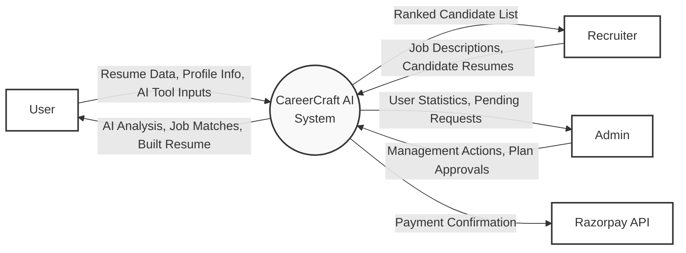
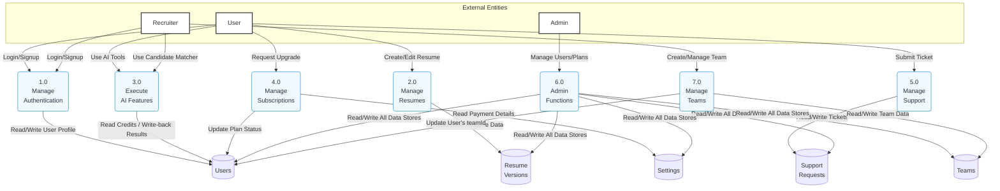
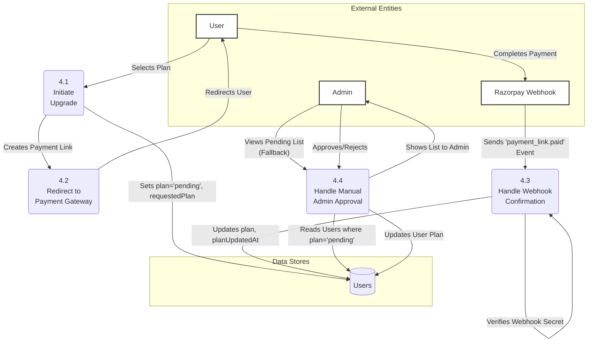
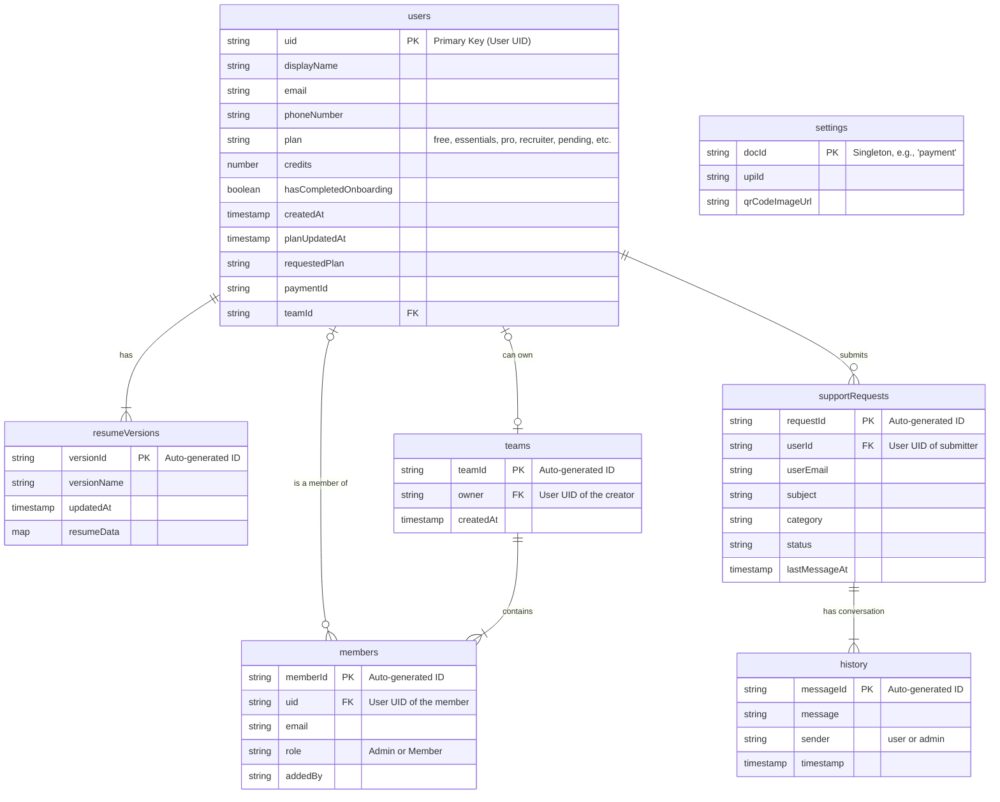

# **CareerCraft AI: An AI-Powered Career Platform**

## **A Project Report Submitted in Partial Fulfillment of the Requirements for the Degree of Bachelor of Computer Applications**

      

### **Submitted By:**
**CHAUHAN HITARTH**

  

### **Guided By:**
**[Your Project Guide's Name]**

      

**INSB Institute of BCA & PGDCA, Idar**
**Affiliated with Hemchandracharya North Gujarat University, Patan**
**Gujarat, India**
**Year: 2024**

# **Certificate**

This is to certify that the project work entitled **“CareerCraft AI”** is a bonafide work carried out by **CHAUHAN HITARTH** in partial fulfillment of the requirements for the award of the degree of **Bachelor of Computer Applications (B.C.A.)** from INSB Institute of BCA & PGDCA, Idar, affiliated with Hemchandracharya North Gujarat University, Patan, during the academic year 2023-2024.

The project work has been carried out under my guidance and is a result of their own work. This work is original and has not been submitted for any other degree or diploma of this or any other university.

    

**_________________________**

**[Your Project Guide's Name]**

**(Internal Guide)**

   

**_________________________**

**[Principal's Name]**

**(Principal)**
**INSB Institute of BCA & PGDCA, Idar**

  

**Place:** Idar
**Date:** `[Date]`

# **Preface**

The modern job market is a challenging landscape, characterized by intense competition and technological gatekeepers like Applicant Tracking Systems (ATS). For job seekers, crafting a compelling resume that stands out is more difficult than ever. For recruiters, the deluge of applications makes identifying top talent a time-consuming and often biased process.

This project, **CareerCraft AI**, was born from the vision to bridge this gap using the power of Artificial Intelligence. It is an attempt to create a comprehensive, intelligent platform that serves both sides of the hiring equation. Our goal was to move beyond traditional, static resume builders and develop a dynamic ecosystem of tools that provide actionable insights, automate tedious tasks, and ultimately empower users in their professional journeys.

The development process was a deep dive into modern full-stack technologies, including Next.js for a reactive frontend, Firebase for a scalable serverless backend, and Google's Genkit for integrating sophisticated AI models. This report documents our journey—from conceptualization and design to implementation, testing, and future enhancements. It details the system's architecture, data flows, and the technical challenges we overcame.

We hope that CareerCraft AI serves as a practical demonstration of how cutting-edge technology can be applied to solve real-world problems, making the path from application to employment more efficient, transparent, and successful for everyone involved.

# **Index / Table of Contents**

| Chapter | Section | Title                                        | Page No. |
|:-------:|:-------:|:-------------------------------------------|:--------:|
| 1.      |         | **Introduction**                           |          |
|         | 1.1     | Acknowledgement                            |          |
|         | 1.2     | About College                              |          |
|         | 1.3     | About Organization/Team                    |          |
|         | 1.4     | Project Profile                            |          |
| 2.      |         | **Literature Survey / Project Overview**   |          |
|         | 2.1     | Overview of Project                        |          |
|         | 2.2     | Existing System                            |          |
|         | 2.3     | Need for New System                        |          |
| 3.      |         | **Analysis**                               |          |
|         | 3.1     | Software & Hardware Requirements           |          |
|         | 3.2     | Objectives                                 |          |
|         | 3.3     | Feasibility Study                          |          |
| 4.      |         | **Experimental / Design & Material Method** |          |
|         | 4.1     | Design Methodology                         |          |
|         | 4.2     | DFD (Data Flow Diagrams)                   |          |
|         | 4.3     | ER (Entity Relationship Diagram)           |          |
|         | 4.4     | Data Dictionary                            |          |
| 5.      |         | **Result & Performance Analysis**          |          |
|         | 5.1     | Process Description (Implementation)       |          |
|         | 5.2     | Input Design (UI/UX Screenshots)           |          |
| 6.      |         | **Conclusion & Future Enhancement**        |          |
|         | 6.1     | Conclusion                                 |          |
|         | 6.2     | Future Enhancement                         |          |
| 7.      |         | **Testing & Bibliography**                 |          |
|         | 7.1     | Testing                                    |          |
|         | 7.2     | Bibliography                               |          |

# **Chapter 1 — Introduction**

## **1.1 Acknowledgement**

We would like to express our heartfelt gratitude to **INSB Institute of BCA & PGDCA** for their unwavering support and encouragement throughout the development of this *CareerCraft AI System*. Their expertise and guidance have been pivotal in shaping the project’s direction and ensuring its successful completion.

We extend our sincere thanks to our **Project Guide** for their invaluable mentorship. Their insightful feedback and constructive critiques have been instrumental in refining the project and enhancing its overall quality. We thank all of the staff members of our college who helped us directly or indirectly during our project period.

This project would not have been possible without the collective contributions of these individuals and organizations. Their support has left an indelible mark on the success of this *CareerCraft AI System*, and for that, we are truly grateful.

**With Regards,**
**CHAUHAN HITARTH**

---

## **1.2 About College**

BCA/PGDCA College, Idar was established by **Uttar Sabarkantha Uchha Kelavani Mandal Idar** in the year 2000 with the aim to serve the educational needs of the rural and developing area of north Sabarkantha.
Our main objective is to provide society with competent men and women who have attributes of functional and social relevance, mental ability and physical dexterity, effectiveness and reliability and above all, the confidence and capability to communicate effectively and exercise initiative, innovation and experiments with new situations.

The management of our college has a definite vision of achieving excellence in being an ideal educational institution, which is being materialized by the sincere efforts of all concerned stakeholders. Our college is engaged in the pious work of modeling the young people who are the builders of the nation.

---

## **1.3 About Organization/Team**

### **🧭 Who We Are**

**CareerCraft AI** is a project developed by a dedicated student developer with a passion for leveraging technology to solve real-world challenges. This project represents a commitment to transforming the way students, job seekers, and recruiters connect through intelligent career management solutions.
Our mission is to create a unified digital platform that empowers users to craft professional resumes, analyze job-fit, and collaborate with recruiters — all powered by artificial intelligence.

### **⚙️ What We Do**

CareerCraft AI integrates modern web technologies and AI-driven analytics to provide personalized career insights, resume optimization, and efficient candidate–recruiter matching.
We focus on building scalable, responsive, and user-friendly systems that combine data intelligence with simplicity and design excellence.

Our areas of expertise demonstrated in this project include:

*   Front-end development using **Next.js** and **Tailwind CSS**.
*   Backend integration with **Firebase Authentication**, **Cloud Firestore**, and **Firebase Storage**.
*   Real-time **AI resume analysis**, **job matching**, and **candidate matcher** tools using **Genkit for Firebase**.
*   Dashboard analytics and management tools for **users, administrators, and recruiters**.
*   Secure payment integration with **Razorpay** and webhook-based subscription management.

### **💡 Why CareerCraft AI**

*   AI-powered Resume, Job Matching, and Candidate Screening System.
*   Clean, Modern, and Responsive UI built with `shadcn/ui`.
*   Scalable and Secure Firebase-based Serverless Architecture.
*   Real-time Data Synchronization & AI-driven Analytics.
*   Dedicated Tools for Recruiters and Team Management.

---

## **1.4 Project Profile**

*   **Project Title**
    *   CareerCraft AI – An AI-Powered Career Platform

*   **Objective**
    *   The primary objective of CareerCraft AI is to deliver a modern, intelligent platform that empowers job seekers with AI-driven tools for resume building and career planning, while simultaneously streamlining the recruitment process for hiring managers. The system aims to bridge the gap between candidate qualifications and employer requirements through smart technology.
    *   Key goals include:
        *   Providing a seamless, real-time resume building and version management experience.
        *   Offering a suite of AI-powered tools for analysis, optimization, and matching.
        *   Supporting secure user authentication and a tiered subscription model with automated payment verification.
        *   Delivering an intuitive and responsive user interface for job seekers, recruiters, and administrators.
        *   Leveraging Firebase and Genkit for a scalable, serverless backend and AI integration.
        *   Equipping recruiters with advanced tools like AI Candidate Matcher and team management.
        *   Providing a comprehensive admin panel for user management, subscription approval, and platform oversight.

*   **Developed By**
    *   CHAUHAN HITARTH

*   **Project Guide/Mentor**
    *   [Your Project Guide's Name]

*   **Frontend Technologies**
    *   **Next.js (v15):** A modern React framework for building performant, server-rendered web applications with the App Router.
    *   **TypeScript:** For strong typing, improved code quality, and developer experience.
    *   **Tailwind CSS:** A utility-first CSS framework for rapid and consistent UI development.
    *   **shadcn/ui:** A collection of beautifully designed, accessible, and composable UI components.
    *   **React Hook Form & Zod:** For robust and type-safe form management and validation.

*   **Backend Technologies**
    *   **Firebase:** Provides a comprehensive serverless backend including:
        *   **Authentication:** For secure user sign-up and login.
        *   **Firestore:** A NoSQL database for all application data storage.
        *   **Storage:** For hosting user-uploaded files like avatars and payment proofs.
    *   **Genkit for Firebase:** A framework for building production-ready AI flows, used to integrate Google's Gemini models for all intelligent features.
    *   **Razorpay:** A payment gateway for handling subscription payments, with verification managed via secure webhooks.

# **Chapter 2 — Literature Survey / Project Overview**

## **2.1 Overview of Project**

CareerCraft AI is an innovative, AI-powered platform meticulously engineered to revolutionize the job application and recruitment lifecycle. It addresses the converging pain points of both modern job seekers and recruiters by providing a centralized ecosystem of intelligent tools.

For **job seekers**, the platform offers more than just a resume builder. It’s a career-enhancement toolkit. Users can create, manage, and version-control professional resumes through an intuitive live-preview editor. The core value lies in the suite of AI-powered features:
*   **AI Resume Analyzer:** Provides instant, detailed feedback on a resume's strengths, weaknesses, and keyword optimization, offering concrete suggestions for improvement.
*   **AI Job Matcher:** Analyzes a user's resume to suggest relevant, albeit fictional, job opportunities tailored to their skills.
*   **AI ATS Optimizer:** Scores a resume against a specific job description, helping users tailor their application to pass through automated screening systems.
*   **AI Cover Letter Generator:** Automatically drafts compelling and personalized cover letters.

For **recruiters**, the platform streamlines the talent acquisition process:
*   **AI Candidate Matcher:** Efficiently scores and ranks a batch of resumes against a job description, drastically reducing manual screening time.
*   **Team Management:** Allows recruiters to create teams, invite members, and collaborate within a shared workspace.

The application is built with a modern, full-stack approach using **Next.js** for a responsive frontend and **Firebase** as a comprehensive serverless backend. All AI functionality is powered by **Genkit for Firebase**, which integrates with Google's powerful Gemini models. A tiered subscription model ('Free', 'Essentials', 'Pro', 'Recruiter') caters to different user needs, with payments handled securely by **Razorpay** and verified via webhooks.

The project’s architecture is designed for scalability, security, and maintainability, serving as a robust case study for integrating serverless backends, payment gateways, and generative AI into a real-world application.

## **2.2 Existing System**

The current digital landscape for career management is dominated by large-scale job portals, professional networking sites, and standalone resume-building tools. While these platforms serve a purpose, they often present a fragmented and inefficient experience.

**1. Major Job Platforms (e.g., LinkedIn, Indeed, Naukri):**
*   **Functionality:** These platforms excel at aggregating job listings and providing a vast network for professionals. LinkedIn, in particular, has become the de facto standard for professional online identity.
*   **Limitations:**
    *   **Generic Tools:** Their resume-building tools are often basic, offering limited templates and minimal guidance.
    *   **Overwhelming Volume:** For recruiters, these platforms generate an overwhelming number of applications, leading to reliance on crude keyword-based filtering.
    *   **Lack of Deep Feedback:** They do not provide actionable, personalized feedback on how to improve a candidate's application materials. The focus is on quantity and reach, not quality and fit.
    *   **Ad-Driven & Distracting:** The user experience can be cluttered with ads, social media features, and sponsored content, distracting from the core task of job hunting.

**2. Standalone Resume Builders (e.g., Zety, Resume.com):**
*   **Functionality:** These tools specialize in creating visually appealing resumes from various templates. They focus on the aesthetic and structural aspects of a resume.
*   **Limitations:**
    *   **Superficial Analysis:** While some offer basic "scoring," this is typically based on simple heuristics like length or keyword density, not a deep, contextual understanding of the content.
    *   **Siloed Experience:** They are disconnected from the job application process. A user must create a resume, then take it elsewhere to find and apply for jobs.
    *   **Aggressive Monetization:** Many operate on a "bait-and-switch" model, allowing users to build a resume for free but charging a fee to download it.

**3. Applicant Tracking Systems (ATS) (e.g., Greenhouse, Lever):**
*   **Functionality:** These are recruiter-facing tools designed to manage the hiring pipeline. They parse and filter resumes based on predefined criteria.
*   **Limitations (from a job seeker's perspective):**
    *   **The "Black Box" Problem:** Job seekers have no visibility into why their resume was rejected by an ATS. They receive no feedback, leading to a frustrating cycle of trial and error.
    *   **Parsing Errors:** Many ATS systems struggle with complex layouts, graphics, or non-standard fonts, unfairly penalizing well-designed resumes.

**Summary of Existing System Limitations:**
The current ecosystem is a patchwork of disconnected tools. Job seekers lack a unified platform that guides them through the entire process—from crafting a high-impact resume to tailoring it for specific roles and finding the right opportunities. Recruiters are buried in manual work and lack intelligent tools to surface the best candidates efficiently and without bias.

## **2.3 Need for New System**

The limitations of the existing systems create a clear and pressing need for a more integrated, intelligent, and user-centric platform. CareerCraft AI is designed to address these specific gaps by building a new system founded on the principles of AI-driven guidance, efficiency, and a unified user experience.

**1. The Need for Intelligent, Actionable Feedback:**
*   **Problem:** Existing tools offer generic advice ("Use action verbs") but fail to provide personalized feedback based on the actual content of a user's resume in the context of a specific job.
*   **Solution:** CareerCraft AI's core feature is its suite of AI analyzers that provide deep, contextual feedback. The **Resume Analyzer** identifies specific weaknesses and offers concrete suggestions, while the **ATS Optimizer** gives a quantifiable match score, empowering users to make targeted improvements.

**2. The Need for a Unified, Seamless Workflow:**
*   **Problem:** Job seekers are forced to jump between different platforms: a resume builder, a job board, and a word processor to write cover letters. This is inefficient and leads to a disjointed experience.
*   **Solution:** CareerCraft AI consolidates these functions into a single dashboard. A user can build their resume, analyze it, find matching jobs, and generate a cover letter without ever leaving the platform. This creates a seamless workflow from creation to application.

**3. The Need to Demystify the "ATS Black Box":**
*   **Problem:** Over 75% of resumes are rejected by Applicant Tracking Systems before a human sees them. Job seekers have no way of knowing if their resume is ATS-compatible.
*   **Solution:** The **ATS Optimizer** simulates how an automated system would score a resume against a job description. It identifies missing keywords and formatting issues, giving users the power to optimize their resume and increase their chances of passing the initial screening.

**4. The Need for Efficient and Unbiased Recruitment Tools:**
*   **Problem:** Recruiters spend countless hours manually sifting through hundreds of resumes, a process that is not only time-consuming but also susceptible to unconscious bias.
*   **Solution:** The **AI Candidate Matcher** automates the initial screening process. By uploading a job description and a batch of resumes, recruiters can instantly get a ranked list of the most qualified candidates with a match score and a justification summary, enabling them to focus their time on the best-fit applicants.

**5. The Need for a Clean, Focused, and Scalable Platform:**
*   **Problem:** Many existing platforms are cluttered, slow, and built on legacy architecture that is difficult to maintain and scale.
*   **Solution:** CareerCraft AI is built on a modern, serverless technology stack (Next.js, Firebase, Genkit). This provides a fast, responsive user experience and ensures the platform is scalable, secure, and cost-effective to operate. The focus is on providing value, not on displaying ads or superfluous social features.

In conclusion, CareerCraft AI is not just another resume builder. It is a new-generation career platform designed to meet the sophisticated demands of the modern job market by providing intelligent, actionable, and integrated tools for both job seekers and recruiters.

# **Chapter 3 — Analysis**

## **3.1 Software & Hardware Requirements**

This section outlines the necessary software and hardware for both the development and end-user environments of the CareerCraft AI application.

### **Server/Development Requirements**

*   **Software Requirements:**
    *   **Operating System:** Windows 10/11, macOS 11 (Big Sur) or later, or a modern Linux distribution (e.g., Ubuntu 20.04+).
    *   **Runtime Environment:** Node.js (v18 or later).
    *   **Package Manager:** pnpm (recommended), npm, or yarn.
    *   **Version Control:** Git.
    *   **Code Editor:** Visual Studio Code (recommended) or any other modern IDE like WebStorm.
    *   **CLI Tools:**
        *   Firebase CLI (for deploying Firestore rules and managing the backend).
        *   Genkit CLI (for running and managing AI flows locally).
    *   **Web Browser:** Latest version of Google Chrome, Mozilla Firefox, or Microsoft Edge for development and testing.
    *   **Cloud Services Accounts:**
        *   A Google Account for accessing Firebase and Google AI Studio.
        *   A Razorpay Account for obtaining payment gateway API keys.

*   **Hardware Requirements:**
    *   **Processor:** Dual-core processor or better.
    *   **RAM:** 8 GB minimum, 16 GB recommended for a smooth development experience.
    *   **Storage:** 20 GB of free disk space for the project, Node.js modules, and associated tools.
    *   **Internet Connection:** A stable broadband internet connection for downloading packages, accessing cloud services, and testing the application.

### **Client/End-User Requirements**

*   **Software Requirements:**
    *   Any modern, up-to-date web browser with JavaScript enabled. Supported browsers include:
        *   Google Chrome (latest 2 versions)
        *   Mozilla Firefox (latest 2 versions)
        *   Microsoft Edge (latest 2 versions)
        *   Safari (latest 2 versions)
    *   A PDF viewer for viewing exported resumes.
    *   No other software installation is required.

*   **Hardware Requirements:**
    *   Any device capable of running a modern web browser, including desktops, laptops, tablets, or smartphones.
    *   A stable internet connection to access the web application.

## **3.2 Objectives**

The core objectives of the CareerCraft AI project were to design, develop, and deploy a comprehensive, AI-driven career platform that serves the needs of job seekers, recruiters, and administrators. The specific, measurable goals are outlined below.

**1. For Job Seekers:**
*   **Intuitive Resume Builder:** To create a user-friendly interface with a live preview for building and editing professional resumes. The system must support multiple sections, including experience, education, projects, and skills.
*   **Resume Version Management:** To allow users to save, manage, and switch between multiple versions of their resume, with limits based on their subscription plan.
*   **AI-Powered Resume Analysis:** To integrate a generative AI model that provides qualitative feedback on a resume's strengths, weaknesses, and areas for improvement.
*   **ATS Optimization:** To develop an AI tool that scores a resume against a given job description, identifying keyword gaps and providing a quantifiable match score.
*   **Intelligent Job Matching:** To implement an AI feature that suggests relevant (fictional) job opportunities based on the content of a user's resume.
*   **Automated Cover Letter Generation:** To create a tool that automatically generates a personalized cover letter by analyzing a user's resume and a target job description.
*   **PDF Export:** To enable users to download their final resume in a professional, well-formatted PDF format.

**2. For Recruiters:**
*   **AI Candidate Matcher:** To build a tool that allows recruiters to upload a job description and multiple resumes, and receive an AI-generated ranked list of candidates with match scores and justifications.
*   **Team Management:** To provide functionality for recruiters on a specific plan to create a team and invite other members via email to collaborate.

**3. System-Wide & Administrative Objectives:**
*   **Secure User Authentication:** To implement a secure login and registration system using Firebase Authentication, supporting email and password sign-in.
*   **Tiered Subscription Model:** To establish a multi-tiered subscription model (Free, Essentials, Pro, Recruiter) with distinct feature access and credit limits.
*   **Manual Payment Verification:** To build a workflow where users can request a plan upgrade, and an administrator can review the request and approve or deny it via an admin panel. (Later upgraded to a secure webhook-based system with Razorpay).
*   **Admin Dashboard:** To create a dedicated dashboard for administrators to manage users, approve subscriptions, and configure platform settings.
*   **Scalable & Secure Backend:** To utilize Firebase (Firestore, Storage) to create a secure, scalable, and serverless backend architecture.
*   **Modern & Responsive UI:** To design and build a clean, modern, and responsive user interface using Next.js and Tailwind CSS that works seamlessly across devices.

## **3.3 Feasibility Study**

A feasibility study was conducted at the project's outset to evaluate its viability across technical, economic, operational, and legal dimensions.

### **1. Technical Feasibility**

*   **Assessment:** The project is highly technically feasible. The chosen technology stack is modern, mature, and well-documented.
    *   **Next.js (React):** A leading framework for building high-performance web applications. Its ecosystem is vast, providing solutions for routing, rendering, and data fetching.
    *   **Firebase:** Offers a complete, managed backend-as-a-service (BaaS), which significantly reduces the complexity of building and maintaining server infrastructure, databases, and authentication systems. Its scalability is well-proven.
    *   **Genkit for Firebase:** Provides a streamlined and officially supported way to integrate Google's powerful Gemini AI models. This abstracts away much of the complexity of calling large language models.
    *   **Razorpay:** A popular and well-documented payment gateway in India, offering clear APIs and webhook support for secure payment processing.
*   **Technical Risks:** The primary technical risk was the integration of these disparate services. However, since they are all designed to work together (especially Firebase and Genkit), this risk was manageable. Potential performance issues with real-time AI analysis were mitigated by using efficient serverless functions and providing clear loading states in the UI.
*   **Conclusion:** The technology is available, proven, and fits the project requirements perfectly. The technical feasibility is high.

### **2. Economic Feasibility**

*   **Assessment:** The project is economically feasible, especially for development and initial deployment.
    *   **Development Costs:** The primary cost is the developer's time. All software and tools used (VS Code, Node.js, Git, Firebase CLI) are open-source or free.
    *   **Operational Costs:**
        *   **Firebase:** Offers a generous free tier ("Spark Plan") that is more than sufficient for development, testing, and supporting a small user base. Costs scale with usage, making it a "pay-as-you-go" model that avoids large upfront expenses.
        *   **Google AI (via Genkit):** The Gemini models also have a free tier for a certain number of requests, making development cost-effective.
        *   **Vercel/Firebase App Hosting:** Hosting for Next.js applications is available with a generous free tier.
    *   **Monetization Potential:** The tiered subscription model provides a clear path to revenue, which could cover and exceed the operational costs as the user base grows.
*   **Conclusion:** With low initial investment and a scalable, usage-based cost model, the project is economically viable.

### **3. Operational Feasibility**

*   **Assessment:** The system is designed to be highly operational.
    *   **For End-Users (Job Seekers & Recruiters):** The UI is designed to be intuitive and user-friendly, requiring no special training. The AI tools automate complex tasks, simplifying the user's workflow.
    *   **For Administrators:** The admin panel centralizes user management and subscription approvals, making platform oversight straightforward. The use of a managed backend (Firebase) means there are no servers to maintain, patches to apply, or databases to manually back up.
*   **Conclusion:** The application is operationally feasible and designed to be low-maintenance from a technical administration perspective.

### **4. Legal & Regulatory Feasibility**

*   **Assessment:**
    *   **Data Privacy:** The application handles personal and sensitive data (resumes, contact information). It is crucial to comply with data privacy regulations. A Privacy Policy has been created to inform users about what data is collected and how it is used. All data is stored securely within Firebase.
    *   **Payment Processing:** Integration with Razorpay requires adherence to their terms of service and standard security practices for handling payments. Using secure webhooks for verification is a key part of this compliance.
*   **Conclusion:** The project is legally feasible, provided that data privacy best practices are followed and clear terms of service and privacy policies are maintained.

# **Chapter 4 — Experimental / Design & Material Method**

## **4.1 Design Methodology**

The design and development of CareerCraft AI were guided by a structured, top-down methodology centered on **Data Flow Diagrams (DFDs)**. This approach was chosen because it allows for a clear and logical representation of the system's processes and data transformations, independent of the underlying physical implementation. By focusing on *what* the system does rather than *how* it does it, we could establish a robust logical model before committing to specific technologies or coding patterns.

The DFD-based methodology proceeds in levels of increasing detail:

1.  **Level 0 (Context Diagram):** This initial, high-level view defines the boundary of the CareerCraft AI system. It identifies the primary external entities that interact with the system (User, Recruiter, Admin) and the major data flows between them and the system as a whole. This step was crucial for establishing the project's scope.

2.  **Level 1 (System Breakdown):** The single process from the Context Diagram is decomposed into its major sub-processes. For CareerCraft AI, this included functions like `Manage Authentication`, `Manage Resumes`, `Execute AI Features`, and `Admin Functions`. This level also introduces the primary data stores (e.g., `Users` collection, `Resumes` collection) and shows how the sub-processes interact with them. This helped in architecting the main modules of the application.

3.  **Level 2 (Process Decomposition):** Each major sub-process from Level 1 is further broken down to reveal more granular detail. For instance, the `Manage Subscriptions` process was detailed to show the flow of a user requesting an upgrade, an admin reviewing it, and the final plan update. This level of detail provided a clear blueprint for implementing specific features and functions.

By following this layered DFD approach, we were able to:
*   Ensure a clear understanding of all system requirements.
*   Identify all necessary data inputs, outputs, and storage points.
*   Logically structure the application into distinct, manageable modules.
*   Create a solid foundation for designing the database schema (ER Diagram) and the application's UI/UX.

This methodology ensured that the system's architecture was driven by its functional requirements, leading to a more coherent, robust, and maintainable final product.

## **4.2 DFD (Data Flow Diagram)**

This section provides a graphical representation of the data flow within the CareerCraft AI system using Data Flow Diagrams (DFDs) at different levels of abstraction.

### **Level 0: Context-Level DFD**

The context-level diagram shows the entire system as a single process and illustrates its interaction with external entities.

*   **External Entities:** User, Recruiter, Admin, Razorpay API.
*   **Process:** The entire CareerCraft AI System.
*   **Data Flows:** Represents the high-level exchange of information between the entities and the system.

### **Level 1: First-Level DFD**

This diagram breaks down the main system into its primary sub-processes and shows the data stores they interact with.

### **Level 2: Second-Level DFD (Example: Process 4.0 Manage Subscriptions)**

This diagram provides a detailed look into the "Manage Subscriptions" process, including the automated webhook flow.

This flow shows the primary path for subscription upgrades is now automated via the Razorpay webhook (Process 4.3). The admin approval flow (Process 4.4) acts as a fallback or for payment methods that don't use the automated link.

## **4.3 ER (Entity Relationship Diagram)**

An Entity-Relationship (ER) Diagram visually represents the database structure, showing the relationships between different data entities. This diagram for CareerCraft AI illustrates the Firestore collections and the connections between them.

**Description of Relationships:**

*   **users ⟷ resumeVersions (One-to-Many):** A user can have many resume versions. This is implemented as a subcollection (`resumeVersions`) within each `user` document.
*   **users ⟷ teams (One-to-Many):** A user with a 'recruiter' plan can own a team. The `teams` document stores the `owner`'s UID. A user's document also contains a `teamId` linking them to the team they belong to.
*   **teams ⟷ members (One-to-Many):** A team can have many members. This is implemented as a `members` subcollection within each `team` document.
*   **users ⟷ supportRequests (One-to-Many):** A user can submit multiple support requests. The `supportRequests` document contains a `userId` to link back to the user.
*   **supportRequests ⟷ history (One-to-Many):** A support request can have many messages in its history. This is implemented as a `history` subcollection within each `supportRequest` document.
*   **settings (Singleton):** This collection is not directly related to others. It holds global configuration documents like `payment`.

## **4.4 Data Dictionary (Database Schema)**

The Data Dictionary provides a detailed specification for each data entity (collection) and its attributes (fields) within the Firestore database. This serves as the blueprint for all data operations in CareerCraft AI.

The complete and authoritative schema is maintained in the `DB_SCHEMA.md` file in the project's root directory. A summary is provided here for reference.

### **1. `users` Collection**
*   **Description:** Stores primary information for each user account.
*   **Document ID:** User's UID from Firebase Authentication.

| Field Name               | Data Type | Description                                                      |
|--------------------------|-----------|------------------------------------------------------------------|
| `uid`                    | `string`  | The user's unique authentication ID.                             |
| `displayName`            | `string`  | The user's full name.                                            |
| `email`                  | `string`  | The user's registered email address.                             |
| `phoneNumber`            | `string`  | The user's 10-digit phone number, used for payment gateway.      |
| `plan`                   | `string`  | The current subscription plan (`free`, `essentials`, `pro`, etc.). |
| `credits`                | `number`  | Number of available AI credits.                                  |
| `hasCompletedOnboarding` | `boolean` | `true` if the user has finished the initial guided tour.         |
| `createdAt`              | `Timestamp`| Timestamp of account creation.                                   |
| `planUpdatedAt`          | `Timestamp`| Timestamp of the last successful plan upgrade.                   |
| `requestedPlan`          | `string`  | The plan a user requested if their status is `pending`.          |
| `paymentId`              | `string`  | The transaction ID from the last successful Razorpay payment.    |
| `teamId`                 | `string`  | Foreign key to the `teams` collection if the user is in a team.  |

### **2. `resumeVersions` Subcollection**
*   **Description:** A subcollection under each user document, storing different versions of their resume.
*   **Path:** `/users/{userId}/resumeVersions/{versionId}`

| Field Name    | Data Type | Description                                    |
|---------------|-----------|------------------------------------------------|
| `versionName` | `string`  | A user-defined or AI-suggested name.           |
| `updatedAt`   | `Timestamp`| Timestamp of the last save operation.          |
| `resumeData`  | `map`     | An object containing the structured resume content. |

*(For the detailed structure of the `resumeData` map, please refer to the `DB_SCHEMA.md` file.)*

### **3. `teams` Collection**
*   **Description:** Stores information about teams created by recruiters.
*   **Document ID:** Auto-generated by Firestore.

| Field Name  | Data Type | Description                              |
|-------------|-----------|------------------------------------------|
| `owner`     | `string`  | The UID of the user who created the team. |
| `createdAt` | `Timestamp`| Timestamp of when the team was created.    |

### **4. `members` Subcollection**
*   **Description:** A subcollection under each team document, storing team member information.
*   **Path:** `/teams/{teamId}/members/{memberId}`

| Field Name | Data Type | Description                                                 |
|------------|-----------|-------------------------------------------------------------|
| `uid`      | `string`  | The member's UID (added after they sign up).                |
| `email`    | `string`  | The email address of the invited member.                    |
| `role`     | `string`  | The member's role (`Admin` or `Member`).                    |
| `addedBy`  | `string`  | The email of the user who invited this member.              |

### **5. `supportRequests` Collection**
*   **Description:** Stores support tickets submitted by users.
*   **Document ID:** Auto-generated by Firestore.

| Field Name      | Data Type | Description                                         |
|-----------------|-----------|-----------------------------------------------------|
| `userId`        | `string`  | The UID of the user who submitted the ticket.       |
| `userEmail`     | `string`  | The email of the user at the time of submission.    |
| `subject`       | `string`  | The subject line of the support request.            |
| `category`      | `string`  | The type of request (`billing`, `technical`, etc.). |
| `status`        | `string`  | The current status (`open`, `in-progress`, `closed`). |
| `lastMessageAt` | `Timestamp`| Timestamp of the last message, for sorting.       |

*(This collection has a `history` subcollection for storing the message thread. See `DB_SCHEMA.md` for details.)*

### **6. `settings` Collection**
*   **Description:** A singleton collection for global application settings.
*   **Document ID:** A fixed string, e.g., `payment`.

| Field Name       | Data Type | Description                               |
|------------------|-----------|-------------------------------------------|
| `upiId`          | `string`  | UPI ID for manual payments (fallback).    |
| `qrCodeImageUrl` | `string`  | URL of the QR code image (fallback).      |

# **Chapter 5 — Result & Performance Analysis**

## **5.1 Process Description (Implementation)**

The CareerCraft AI application is implemented as a modern, full-stack web application with a clear separation of concerns between the user-facing modules and the administrative backend. The implementation leverages a serverless architecture to ensure scalability, security, and ease of maintenance.

### **1. User & Recruiter Module**

This is the core module of the application, providing all the primary features for job seekers and recruiters.

*   **User Authentication & Session Management:**
    *   Implemented using **Firebase Authentication**. The `useAuth` custom hook (`src/hooks/use-auth.tsx`) provides a centralized interface for managing user state (login, logout, signup) and listening to authentication changes.
    *   Upon successful login/signup, a corresponding user document is created or read from the `users` collection in **Firestore**. This document stores application-specific data like `plan` and `credits`.
    *   The user's plan and permissions are made available throughout the application via the `AuthContext`, ensuring that feature access is dynamically controlled.

*   **Resume Builder & Versioning:**
    *   The `ResumeBuilder` component (`src/components/resume-builder.tsx`) is the heart of the user dashboard. It uses React state to manage the resume data in real-time.
    *   Input fields are tied to the state, and any change immediately triggers a re-render of the live preview panel, providing instant visual feedback.
    *   Resume versions are stored as separate documents in the `/users/{userId}/resumeVersions` subcollection. A dropdown menu allows users to switch between versions, which updates the component's state with the selected version's data.
    *   Save operations (`handleSave`, `handleSaveAsNew`) perform writes to Firestore, either updating the current document or creating a new one.

*   **AI Feature Integration:**
    *   All AI features are implemented as **Genkit Flows** in the `src/ai/flows/` directory. Each flow is a server-side function that defines a prompt, input/output schemas (using Zod), and calls the Google Gemini model.
    *   Client components (e.g., `ResumeAnalyzerPage`) collect user input (files, text), convert files to data URI strings, and call the AI flows via **Next.js Server Actions** defined in `src/lib/actions.ts`.
    *   This architecture keeps all expensive AI processing and API key usage securely on the server, while the client only handles UI and data submission/display. Credit usage is handled by the `useCredit` function in the `useAuth` hook, which decrements the user's credit count in Firestore.

*   **Subscription & Payment Flow:**
    *   The `PricingPage` component (`src/components/pricing-page.tsx`) displays the available plans.
    *   When a user clicks "Upgrade," the `handlePayment` function is called. It first updates the user's plan to `pending` in Firestore.
    *   It then calls a Server Action (`createPaymentLink` in `src/lib/razorpay.ts`) which securely communicates with the Razorpay API to create a unique payment link.
    *   The user is redirected to Razorpay to complete the payment.
    *   Upon successful payment, Razorpay sends a notification to our secure webhook endpoint (`/api/razorpay/webhook`). This server-side route verifies the request's signature using a secret key and, upon success, updates the user's plan in Firestore to `pro`, `recruiter`, etc., and records the `paymentId`. This is the authoritative source of truth for plan upgrades.

### **2. Admin Module**

The admin panel is a separate, access-controlled section of the application for platform management.

*   **Access Control:**
    *   The `AdminLayout` component (`src/app/admin/layout.tsx`) wraps all admin pages. It uses the `useAuth` hook to check if the logged-in user's email is in the `ADMIN_EMAILS` list. If not, it redirects the user away from the admin area, ensuring security.

*   **User & Subscription Management:**
    *   Admin components (e.g., `UserManagementPage`, `UpgradeRequestsPage`) fetch data directly from Firestore collections.
    *   They query the `users` collection to display lists of all users or those with a specific plan status like `pending`.
    *   Admin actions (e.g., changing a user's plan, deleting a user, approving a request) are implemented as functions that perform authenticated writes to Firestore using the Firebase SDK. For example, approving an upgrade involves calling `updateDoc` on the user's document to change their `plan` field.

*   **Platform Configuration:**
    *   The `PaymentSettings` component allows the admin to update the fallback UPI ID and QR code. It reads from and writes to the singleton `settings/payment` document in Firestore.

This modular and serverless implementation results in a performant, secure, and highly scalable application.

## **5.2 Input Design (UI/UX Screenshots)**

The user interface of CareerCraft AI is designed to be clean, modern, and intuitive, ensuring a seamless user experience for all user types. The design leverages the `shadcn/ui` component library and Tailwind CSS for a consistent and responsive layout.

### **1. User & Recruiter Module**

This is the primary interface for job seekers and recruiters.

*   **Dashboard (Resume Builder):** The main dashboard features a two-panel layout: an editable form on the left for all resume sections and a live, real-time preview of the resume on the right. This provides immediate visual feedback to the user as they build their resume.
    

*   **AI Tools (ATS Optimizer):** Each AI tool has a dedicated page with a simple input form. For the ATS Optimizer, this includes a file upload for the resume and a text area for the job description. Results are displayed in a structured and easy-to-digest format.
    

*   **Candidate Matcher (Recruiter):** The recruiter-specific tool allows for uploading a job description and multiple resumes. The results are presented in a clean table, ranking candidates by their match score and providing AI-generated justifications.
    

### **2. Admin Module**

The admin panel is designed for efficient management and oversight.

*   **Admin Dashboard:** The main landing page for admins features statistical cards (e.g., total users, plan distribution) and a chart visualizing user data, providing a quick overview of platform health.
    

*   **User Management:** This page presents a list of all users in a clean, tabular format. Admins can quickly view user details, see their current subscription status, and use a dropdown menu to perform actions like changing a plan or deleting a user.
    

*   **Upgrade Requests:** Pending upgrade requests are displayed in a dedicated table. This allows the admin to see who has requested an upgrade and approve or reject the request with a single click, providing a fallback for the automated webhook system.
    

# **Chapter 6 — Conclusion & Future Enhancement**

## **6.1 Conclusion**

The CareerCraft AI project successfully achieves its objective of delivering a modern, responsive, and intelligent web application designed to streamline the career development and recruitment process. By integrating a user-friendly interface with a powerful suite of AI-driven tools, the platform provides significant value to job seekers, recruiters, and administrators alike.

The project effectively demonstrates the seamless integration of a cutting-edge technology stack:
*   **Next.js** provides a performant, server-rendered frontend with a component-based architecture.
*   **Firebase** serves as a robust, scalable, and secure serverless backend, handling authentication, database (Firestore), and file storage with ease.
*   **Genkit for Firebase** proves to be an exceptional framework for abstracting the complexities of generative AI, allowing for the rapid development of powerful features like the Resume Analyzer, ATS Optimizer, and Candidate Matcher.
*   **Razorpay and Webhooks** establish a secure and reliable automated payment and subscription management system, which is critical for a production-ready application.

The final application provides a cohesive and efficient workflow for all user types. Job seekers are empowered with tools that give them a competitive edge, moving beyond simple resume creation to deep, actionable insights. Recruiters benefit from AI-powered automation that saves time and reduces bias in the initial screening process. The comprehensive admin panel ensures that the platform is manageable, maintainable, and ready for growth.

In summary, CareerCraft AI stands as a successful proof-of-concept and a solid foundation for a real-world Software-as-a-Service (SaaS) product. It not only meets all the initial project objectives but also provides a flexible and scalable architecture poised for future expansion and innovation.

## **6.2 Future Enhancement**

While the current version of CareerCraft AI is a robust and feature-rich platform, there are numerous opportunities for future enhancements that could further increase its value and market competitiveness.

### **User & Job Seeker Features**

*   **AI Mock Interviews:** Develop an interactive AI agent that can conduct a mock interview based on a user's resume and a target job description. The AI could ask relevant questions and provide feedback on the user's answers, tone, and clarity.
*   **Live Job Board Integration:** Connect with APIs from major job platforms like LinkedIn, Indeed, or Foundit to pull in and display real-time job listings directly within the Job Matcher tool.
*   **Advanced Resume Performance Analytics:** Create a dashboard for Pro users to track their application success. This could include analytics on resume views (if a shareable link feature is added), interview invitations, and success rates for different resume versions.
*   **Skill Gap Learning Pathways:** Enhance the Skill Gap Analysis by not just suggesting course titles, but by integrating with online learning platforms (like Coursera or Udemy) to provide direct links to relevant courses for the identified missing skills.
*   **Portfolio Showcase:** Allow users to build a more comprehensive portfolio page within the app, including images, case study descriptions, and embedded project demos, which can be shared via a public link.

### **Recruiter & Admin Tools**

*   **Advanced Recruiter Analytics:** Provide recruiters with a dashboard to visualize their hiring funnel, including statistics on the number of resumes screened, top-performing candidates, and time-to-hire metrics.
*   **Automated Candidate Outreach:** Allow recruiters to create email templates and automatically send outreach messages to top-ranked candidates directly from the platform.
*   **Admin Moderation Dashboard:** Implement tools for admins to flag or review user-generated content to ensure platform integrity.
*   **Detailed Audit Logs:** Create a logging system for all major admin actions (e.g., plan changes, user deletions) for security and accountability.

### **Monetization & UI/UX Improvements**

*   **Fully Automated Payment Gateway:** While Razorpay is integrated, the current fallback for manual approval could be fully replaced by integrating a complete subscription management service like Stripe Billing, which handles recurring payments, prorations, and cancellations automatically.
*   **Enterprise Plan for Companies:** Introduce a higher-tier "Enterprise" plan for larger companies, offering features like Single Sign-On (SSO) integration, a higher number of job postings, and dedicated support.
*   **PWA (Progressive Web App) Support:** Enhance the mobile experience by adding PWA capabilities, allowing users to "install" the app on their home screen and potentially use some features offline.
*   **UI Theme Customization:** Allow users to choose from a wider variety of themes and color palettes to personalize their experience.
*   **Gamification & Badges:** Introduce badges or a points system for completing resume sections, acing AI analyses, or applying for jobs, to increase user engagement.

# **Chapter 7 — Testing & Bibliography**

## **7.1 Testing**

A multi-layered testing strategy was employed to ensure the application's quality, reliability, and performance. This approach combines manual checks with plans for automated testing to cover different aspects of the system.

*   **1. Manual Testing (Executed):**
    *   **Objective:** To test the application from an end-user's perspective, covering complete user journeys and identifying any UI/UX issues that automated tests might miss.
    *   **Process:** Manually executed all key user flows across different modern browsers (Chrome, Firefox, Edge).
    *   **Key Scenarios Tested:**
        *   **User Authentication:** Successfully signing up, logging in, logging out, and using the "Forgot Password" flow.
        *   **Resume Builder:** Creating, editing, and saving a resume. Verifying that all fields update the live preview correctly. Adding and removing dynamic sections like experience and projects.
        *   **Version Management:** Saving a resume as a new version, switching between versions, and ensuring the correct data is loaded.
        *   **AI Features:** Using the Resume Analyzer, Job Matcher, ATS Optimizer, and Cover Letter Generator with valid PDF files and text inputs to ensure results are generated and displayed correctly.
        *   **Subscription & Payment Flow:**
            *   Simulating a user upgrading to a Pro plan by initiating a payment.
            *   Testing the redirection to the Razorpay gateway.
            *   Verifying that the webhook correctly updates the user's plan in Firestore upon successful payment simulation.
            *   Confirming that the user's profile and access rights are updated post-upgrade.
        *   **Admin Panel:** Logging in as an admin, viewing the user list, changing a user's plan manually, and approving/rejecting pending requests.

*   **2. Integration Testing (Planned):**
    *   **Objective:** To verify that different parts of the application work together as expected. This is especially important for a full-stack application that relies on external services like Firebase and Razorpay.
    *   **Tools:** The plan is to use **Jest** and **React Testing Library**, with mocking for external services.
    *   **Example Scenarios:**
        *   Testing the login flow to ensure the `LoginForm` component correctly calls the `useAuth` hook, which in turn interacts with mocked Firebase Authentication services.
        *   Testing the "Save Resume" functionality to ensure that state changes in the UI trigger the correct `updateDoc` call to a mocked Firestore instance.

*   **3. Validation Testing (Executed Manually):**
    *   **Objective:** To ensure that all form inputs are correctly validated according to the defined schemas.
    *   **Process:** Used **Zod** for schema definition and **React Hook Form** for client-side validation. Manually tested all forms to ensure that appropriate error messages are displayed for invalid input (e.g., incorrect email format, password too short, required fields left empty).

*   **4. Responsiveness & Cross-Browser Testing (Executed Manually):**
    *   **Objective:** To ensure the application provides a consistent and usable experience across different screen sizes and browsers.
    *   **Process:** Used browser developer tools to simulate various device viewports (mobile, tablet, desktop). Manually tested the layout and functionality on the latest versions of Google Chrome, Mozilla Firefox, and Microsoft Edge. Confirmed that the responsive design using Tailwind CSS works as expected.

## **7.2 Bibliography**

The development of CareerCraft AI was made possible by referencing the official documentation and community resources of the various technologies and frameworks used. These resources were instrumental in understanding best practices, troubleshooting issues, and implementing features correctly.

### **Reference Books**

*   *Learning React: Modern Patterns for Developing React Apps* by Alex Banks & Eve Porcello.
*   *Programming TypeScript: Making Your JavaScript Applications Scale* by Boris Cherny.

### **Online Resources**

*   **Next.js Official Documentation:**
    *   URL: [https://nextjs.org/docs](https://nextjs.org/docs)
    *   Used extensively for understanding the App Router, Server Components, Server Actions, and deployment configurations.

*   **Firebase Documentation:**
    *   URL: [https://firebase.google.com/docs](https://firebase.google.com/docs)
    *   Essential for learning and implementing Firebase Authentication, Firestore (queries, security rules, data modeling), and Firebase Storage.

*   **Genkit for Firebase Documentation:**
    *   URL: [https://firebase.google.com/docs/genkit](https://firebase.google.com/docs/genkit)
    *   The primary resource for defining AI flows, creating prompts for the Gemini model, and managing input/output schemas with Zod.

*   **Tailwind CSS Documentation:**
    *   URL: [https://tailwindcss.com/docs](https://tailwindcss.com/docs)
    *   The complete reference for all utility classes used for styling the application.

*   **shadcn/ui Documentation:**
    *   URL: [https://ui.shadcn.com/](https://ui.shadcn.com/)
    *   Used for component structure, usage examples, and theming guidance for all UI components.

*   **React Hook Form Documentation:**
    *   URL: [https://react-hook-form.com/](https://react-hook-form.com/)
    *   Referenced for best practices in building and validating forms.

*   **Zod Documentation:**
    *   URL: [https://zod.dev/](https://zod.dev/)
    *   Used for defining all data validation schemas for forms and AI flows.

*   **Razorpay Documentation:**
    *   URL: [https://razorpay.com/docs/](https://razorpay.com/docs/)
    *   Critical for understanding how to create payment links and, most importantly, how to set up and securely verify webhooks.

*   **Stack Overflow & GitHub:**
    *   Used for troubleshooting specific technical issues, finding solutions to common errors, and exploring community-contributed code examples related to the tech stack.
