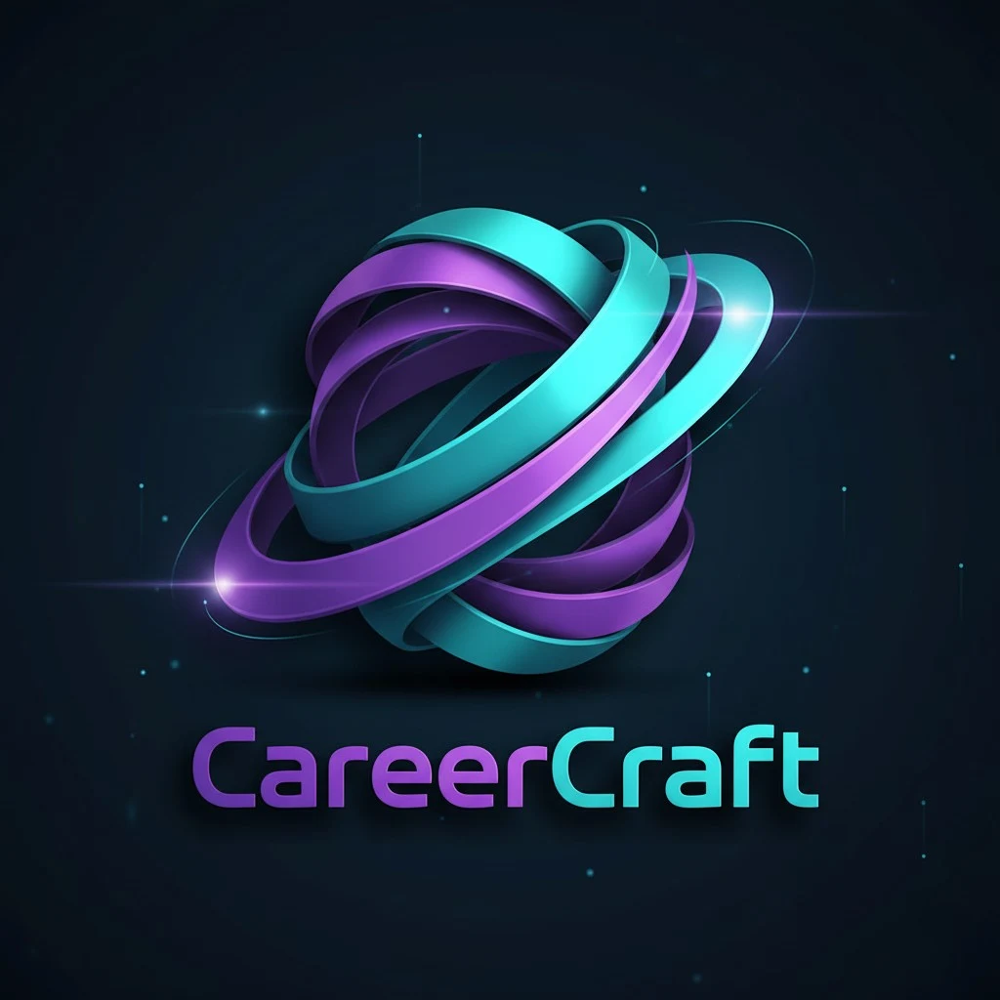
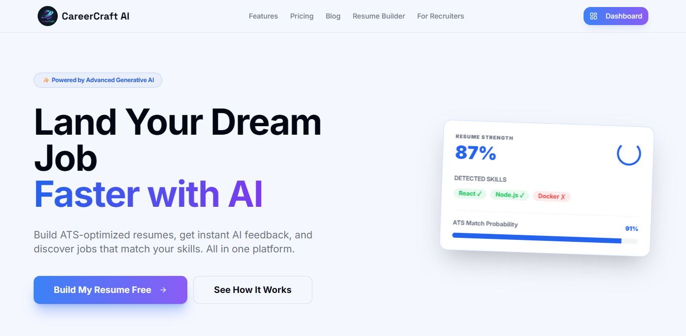
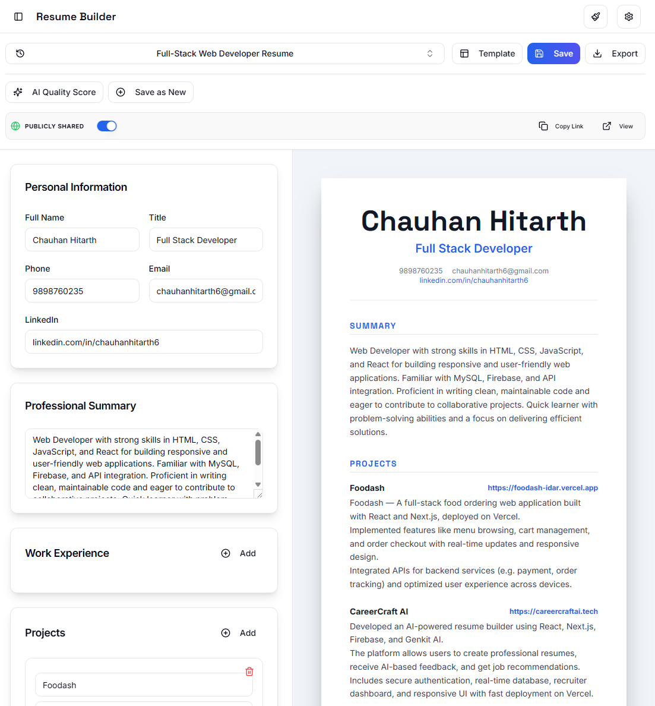
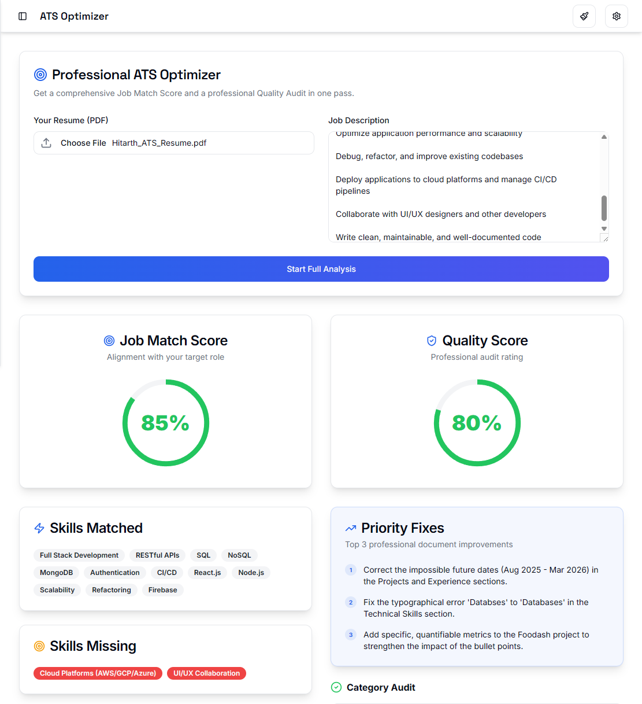

<div align="center">
  
  
  # CareerCraft AI
  
  [](https://careercraftai.tech)
  [](https://opensource.org/licenses/MIT)
  [](https://github.com/Hit246/carrercraftai/stargazers)
  [](https://nextjs.org/)
  [](https://firebase.google.com/)

  **Empowering Indian Students to land their dream jobs with AI-driven career tools.**

  [Live Demo](https://careercraftai.tech) • [Report Bug](https://github.com/Hit246/carrercraftai/issues) • [Request Feature](https://github.com/Hit246/carrercraftai/issues)
</div>

---

<a name="toc"></a>
## 📑 Table of Contents
- [What is it?](#intro)
- [The Problem](#problem)
- [The Solution](#solution)
- [Features](#features)
- [Demo](#demo)
- [Tech Stack](#tech-stack)
- [Quick Start](#quick-start)
- [Environment Variables](#env)
- [Roadmap](#roadmap)
- [Contributing](#contributing)
- [About the Developer](#author)

---

<a name="intro"></a>
## 🚀 What is it?
CareerCraft AI is an all-in-one, AI-powered career platform designed specifically for the Indian job market. It streamlines the job application process by helping students build professional resumes, optimize them for ATS filters, and discover matching opportunities using Google's Gemini AI.

---

<a name="problem"></a>
## 😟 The Problem
*   **ATS Rejection:** 75% of resumes are rejected by Applicant Tracking Systems before a human even sees them.
*   **Generic Content:** Many Indian students use generic templates that don't highlight their specific technical strengths.
*   **Skill Gaps:** A lack of clarity on which skills are actually missing for specific roles at top tech companies.
*   **Information Overload:** Students are overwhelmed by thousands of job postings that don't fit their actual profiles.

---

<a name="solution"></a>
## ✨ The Solution
| Problem | CareerCraft AI Solution |
| :--- | :--- |
| **Manual Resume Building** | Drag-and-drop builder with LaTeX-grade professional templates. |
| **High ATS Rejection** | Real-time ATS scoring against 23+ professional checkpoints. |
| **Generic Guidance** | Personalized AI feedback on strengths, weaknesses, and skill gaps. |
| **Difficult Job Search** | Smart AI Matcher that pairs your unique skills with relevant roles. |

---

<a name="features"></a>
## 🛠️ Features

### 📄 Professional Resume Ecosystem
*   **Dynamic Builder:** Create multiple versions of your resume with instant live previews.
*   **LaTeX-Style Templates:** High-fidelity templates (Classic, Modern, Minimalist) optimized for readability.
*   **Public Share Links:** Generate unique URLs to share your live resume directly with recruiters.

### 🤖 AI-Powered Intelligence
*   **ATS Optimizer:** Match your resume against any job description to get a percentage fit score.
*   **Resume Scorer:** Deep-dive analysis into content quality, action verbs, and quantification.
*   **Cover Letter Generator:** Context-aware letters tailored to specific companies and roles.

### 💼 Career Tools
*   **Smart Job Matcher:** Discover opportunities that align with your resume's technical stack.
*   **Candidate Ranking:** specialized tools for recruiters to rank pools of applicants instantly.
*   **Credit System:** Managed AI usage with monthly credit resets and tiered subscription plans.

---

<a name="demo"></a>
## 📸 Demo

### Landing Page


### User Dashboard


### AI Resume Builder


### ATS Optimization & Professional Audit


---

<a name="tech-stack"></a>
## 💻 Tech Stack
| Layer | Technology |
| :--- | :--- |
| **Framework** | Next.js 15 (App Router) |
| **Language** | TypeScript |
| **UI/UX** | React, Tailwind CSS, ShadCN UI, Lucide Icons |
| **Authentication** | Firebase Auth (Google & Email/Password) |
| **Database** | Firestore |
| **Storage** | Firebase Storage (Avatars, PDFs, Proofs) |
| **AI Engine** | Firebase Genkit with Gemini 1.5 Pro |
| **Payments** | Razorpay SDK |
| **Email** | Resend API & Nodemailer (SMTP) |
| **Deployment** | Vercel |

---

<a name="quick-start"></a>
## 🏁 Quick Start

### Prerequisites
*   Node.js 18+
*   Firebase Project (Auth, Firestore, Storage enabled)
*   Gemini API Key

### Installation
1.  **Clone the Repository**
    ```bash
    git clone https://github.com/Hit246/carrercraftai.git
    cd carrercraftai
    ```

2.  **Install Dependencies**
    ```bash
    npm install
    ```

3.  **Setup Environment Variables**
    Copy `.env.example` to `.env` and fill in your credentials.

4.  **Run Development Server**
    ```bash
    npm run dev
    ```

---

<a name="env"></a>
## 🔑 Environment Variables
Check `.env.example` for the full list of required keys.
```env

# ── AI ────────────────────────────────────────────────────
GEMINI_API_KEY_NEW=

# ── Firebase Client (Public) ──────────────────────────────
NEXT_PUBLIC_FIREBASE_PROJECT_ID_NEW=
NEXT_PUBLIC_FIREBASE_APP_ID_NEW=
NEXT_PUBLIC_FIREBASE_STORAGE_BUCKET_NEW=
NEXT_PUBLIC_FIREBASE_API_KEY_NEW=
NEXT_PUBLIC_FIREBASE_AUTH_DOMAIN_NEW=
NEXT_PUBLIC_FIREBASE_MESSAGING_SENDER_ID_NEW=

# ── Firebase Admin (Server) ───────────────────────────────
# Note: Should be a JSON string of your service account key
FIREBASE_SERVICE_ACCOUNT_KEY_NEW=

# ── Payments (Razorpay) ──────────────────────────────────
NEXT_PUBLIC_RAZORPAY_KEY_ID_NEW_NEW=
RAZORPAY_KEY_ID_NEW=
RAZORPAY_KEY_SECRET_NEW=
RAZORPAY_WEBHOOK_SECRET_NEW=

# ── Email ─────────────────────────────────────────────────
RESEND_API_KEY_NEW=
SMTP_HOST_NEW=
SMTP_PORT=587
SMTP_USER_NEW=
SMTP_PASS_NEW=
ADMIN_EMAIL=support@careercraftai.tech

# ── App ───────────────────────────────────────────────────
NEXT_PUBLIC_APP_URL=https://careercraftai.tech
```

---

<a name="roadmap"></a>
## 🗺️ Roadmap
- [x] AI Resume Analysis & ATS Scoring
- [x] Multi-template Resume Builder
- [x] Razorpay Payment Integration
- [ ] In Progress: Mobile App (React Native)
- [ ] Planned: Interview Preparation AI Bot
- [ ] Planned: Referral Network for Indian Startups

---

<a name="contributing"></a>
## 🤝 Contributing
1.  Fork the Project (`git fork`)
2.  Create your Feature Branch (`git checkout -b feature/AmazingFeature`)
3.  Commit your Changes (`git commit -m 'Add some AmazingFeature'`)
4.  Push to the Branch (`git push origin feature/AmazingFeature`)
5.  Open a Pull Request

---

<a name="author"></a>
## 👤 About the Developer
**Hitarth Chauhan**
Full Stack Developer passionate about building tools that solve real-world problems for students.

[](https://hitarth-chauhan.vercel.app)
[](https://linkedin.com/in/chauhanhitarth6)

---

<div align="center">
  Built with ❤️ for the Indian Student Community
</div>