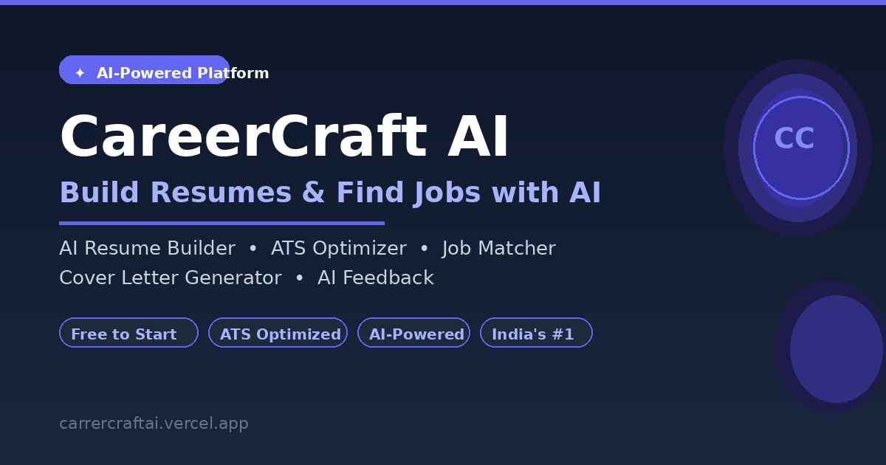

# CareerCraft AI

[](https://opensource.org/licenses/MIT)
[](https://nextjs.org/)
[](https://firebase.google.com/)
[](https://firebase.google.com/docs/genkit)
[](https://ui.shadcn.com/)

An AI-powered platform designed to empower job seekers and recruiters. Build stunning resumes, receive intelligent feedback, discover matching job opportunities, and streamline the hiring process.



## ✨ Key Features

### For Job Seekers:
- **📄 Intuitive Resume Builder:** Create professional resumes with a live preview and customizable sections.
- **🤖 AI Resume Analyzer:** Get instant, actionable feedback on your resume's strengths, weaknesses, and areas for improvement.
- **🤝 AI Job Matcher:** Upload your resume to discover job opportunities tailored to your skills.
- **✉️ AI Cover Letter Generator:** Automatically create compelling and personalized cover letters.
- **🔒 Secure Authentication:** Standard email/password authentication with Google Auth support.
- **💎 Tiered Subscriptions:** Free, Essentials, and Pro plans with AI credit management.

### For Recruiters:
- **🎯 AI Candidate Matcher:** Upload a job description and resumes to find the top matching candidates instantly.
- **📊 Recruiter Dashboard:** Manage your shortlisted talent and view pipeline analytics.
- **📊 Admin Dashboard:** Comprehensive oversight of users, payments, and support tickets.

## 🚀 Tech Stack

- **Framework:** Next.js 15 (App Router)
- **AI Integration:** Firebase Genkit with Gemini Models
- **Backend:** Firebase (Auth, Firestore, Storage)
- **Payments:** Razorpay (Webhooks + Manual fallback)
- **Email/Drips:** Resend (Onboarding) & Nodemailer (SMTP for Alerts)

## 🛠️ Getting Started

### 1. Set Up Environment Variables

Create a `.env` file in the root directory:

```env
# Firebase Public Config
NEXT_PUBLIC_FIREBASE_PROJECT_ID='...'
NEXT_PUBLIC_FIREBASE_APP_ID='...'
NEXT_PUBLIC_FIREBASE_STORAGE_BUCKET='...'
NEXT_PUBLIC_FIREBASE_API_KEY='...'
NEXT_PUBLIC_FIREBASE_AUTH_DOMAIN='...'
NEXT_PUBLIC_FIREBASE_MESSAGING_SENDER_ID='...'

# Firebase Admin (CRITICAL for account deletion)
FIREBASE_SERVICE_ACCOUNT_KEY='{"type": "service_account", ...}'

# AI & Payments
GEMINI_API_KEY='...'
NEXT_PUBLIC_RAZORPAY_KEY_ID='...'
RAZORPAY_KEY_SECRET='...'
RAZORPAY_WEBHOOK_SECRET='...'
NEXT_PUBLIC_APP_URL='https://careercraftai.tech'

# Email Automation (Resend)
RESEND_API_KEY='re_...'

# Admin & Transactional Notifications (SMTP)
SMTP_HOST='smtp.gmail.com'
SMTP_PORT=587
SMTP_USER='your-email@gmail.com'
SMTP_PASS='your-16-character-app-password'
ADMIN_EMAIL='hello@careercraftai.tech'
```

### 2. Run the Development Server

```bash
npm install
npm run dev
# In a separate terminal:
npm run genkit:dev
```

## ✍️ Author
- **CHAUHAN HITARTH**
